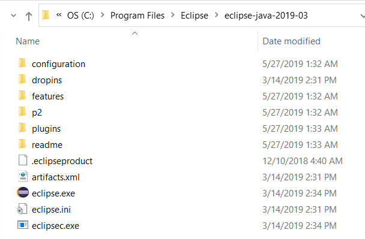

# TSTool / Development Environment / Eclipse ##

* [Introduction](#introduction)
* [Download Eclipse Neon](#download-eclipse-neon)
* [Install Eclipse Neon ](#install-eclipse-neon)
* [Check Eclipse Run Script](#check-eclipse-run-script)

-----

## Introduction ##

The Eclipse Integrated Development Environment (IDE) has traditionally been used for TSTool software development and is recommended.
Alternate IDEs may be supported at some point; however, investigating impacts of using other IDEs
on TSTool development will require resources.
Eclipse does have some issues and limitations, but other IDEs have different issues.

TSTool development has typically occurred on Windows computers, although the software is often deployed to other operating systems.

As discussed in the [Java 8](java8) section, Java 8 is currently used for development and 32-bit Java is used due to component requirements.
Therefore, to avoid confusion with compatibility, Eclipse 32-bit is also used.
TSTool has been developed with Eclipse Neon.  A later version of Eclipse will be phased in as other updates occur.
The minor Eclipse version is not generally an issue so the latest version should be used.

The Eclipse `.project` file is currently saved in the Git repository for each TSTool component repository
in order to facilitate development environment setup.  This may change in the future.
Using a compatible version of Eclipse between developers ensures that the format of such files is consistent.

The Eclipse workspace (`.metadata`) folder is not saved in Git repository.

## Download Eclipse Neon ##

The download links for Eclipse may change as new versions are released.  Search for "download eclipse neon", which indicates that
downloads are available on the following site (or similar).
For example, this may return:

* [Eclipse Neon 3 Packages](http://www.eclipse.org/downloads/packages/release/Neon/3)

Download the ***Eclipse IDE for Java Developers*** (there is currently no reason to use the Eclipse IDE for Java EE Developers,
which is used for web development).  Make sure to select the ***Windows 32-bit*** version.
The zip file is convenient because it is very clear where the software is installed.

## Install Eclipse Neon ##

The Eclipse Neon installer file will be named `eclipse-java-neon-3-win32.zip` or similar.
Note that later versions of Eclipse provide an installation program so these instructions need to be updated when later versions of Eclipse are used.

To avoid confusion with other versions of Eclipse that may be installed on the computer (as needed for other product development),
install by copying/unzipping into a folder named `C:\Program Files (x86)\eclipse-java-neon-3-win32`.
The resulting folder structure is as shown in the following figure.
This is a bit redundant withe the extra `eclipse` folder but clearly indicates the version and preserves the folder names from the zip file distribution.

## Check Eclipse Run Script ##

The `cdss-app-tstool-main` repository `build-util` folder contains scripts to run the correct version of Eclipse,
assuming a standard installation folder.  For example, `run-eclipse-neon3-win32.bat` can be run from a Windows command shell.
This ensures that the proper version of Eclipse and configuration is used.
If necessary, this script can be modified or other versions added over time (for example for new versions of Eclipse).
