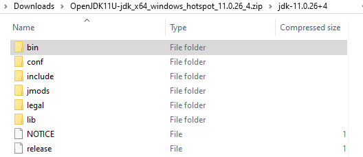
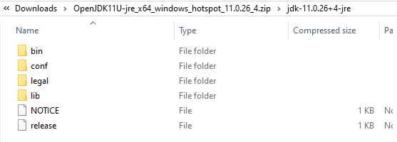
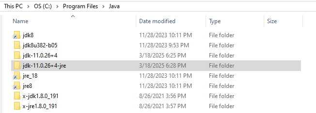
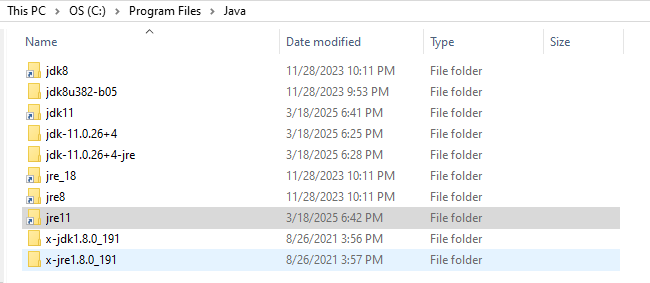
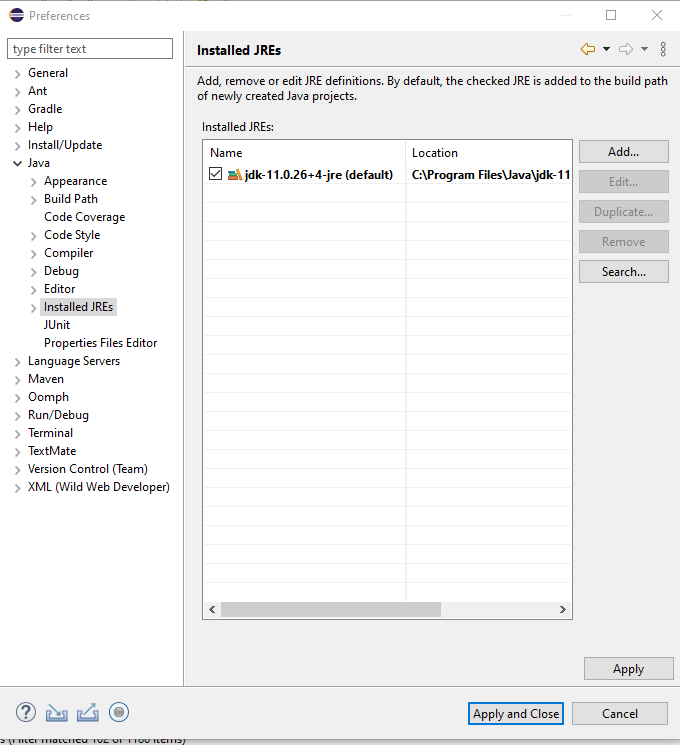
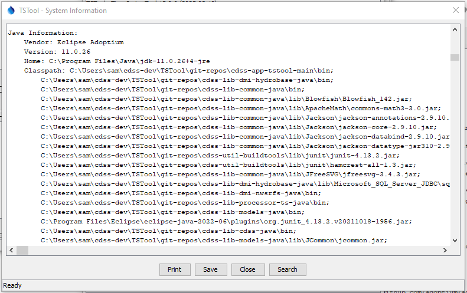

# TSTool / Development Environment / Java #

*   [Introduction](#introduction)
*    [Windows](#windows)
    +   [Download OpenJDK Java 11](#download-openjdk-java-11)
    +   [Install OpenJDK Java 11](#install-openjdk-java-11)
    +   [Create Symbolic Links for OpenJDK Java 11](#create-symbolic-links-for-openjdk-java-11)
    +   [Confirm OpenJDK Java 11 Eclipse Run Script Configuration](#confirm-openjdk-java-11-eclipse-run-script-configuration)
*    [Linux](#linux)

------

## Introduction ##

TSTool is written in Java and therefore the following Java software must be installed:

*   Java Development Kit (JDK) environment for development
*   Java Runtime Environment (JRE) for development and deployed environments

The primary development environment is the Eclipse IDE for Java Developers on Windows.
Java is installed first and then Eclipse (see the [Development Environment / Eclipse](../eclipse/eclipse.md) documentation).
The Windows files are used to create the Linux installer.

The following table summarizes the Java versions that are used with TSTool versions.
Documentation for older versions is retained as a historical reference and for comparison,
and the current developer documentation focuses on the most recent supported software versions.

The conventions for Java version have changed over time,
with early versions relying on the minor (2nd) version part
(see ["Java version history" on Wikipedia](https://en.wikipedia.org/wiki/Java_version_history)).
The current convention is straightforward and relies on the major (1st) version part, with two major version releases per year.
To provide a stable environment, TSTool is developed and released using a long-term support (LTS) Java release.
Java 8 was used for many years and newer TSTool releases will correspond to Java LTS releases.

**<p style="text-align: center;">
TSTool Versions and Corresponding Java Versions
</p>**

| **TSTool Version** | **Java Version**&nbsp;&nbsp;&nbsp;&nbsp;&nbsp;&nbsp;&nbsp;&nbsp;&nbsp;&nbsp;&nbsp;&nbsp;&nbsp;&nbsp;&nbsp;&nbsp;&nbsp;&nbsp;&nbsp;&nbsp;&nbsp;&nbsp;&nbsp;&nbsp;&nbsp;&nbsp;&nbsp;&nbsp;&nbsp;&nbsp; | **Comment** |
| -- | -- | -- |
| 15.0.0 | OpenJDK Java 11 64-bit | Installation is described in this documentation. |
| 14.9.0 | OpenJDK Java 8 64-bit | Oracle began charging a fee for Java as of January 2019 and the OpenJDK Java distribution is used to avoid fees and allow updates. The initial OpenJDK version will be updated as resources allow and automated tests pass. See the [archived documentation](java8-openjdk/java8-openjdk.md). |
| 14.0.0 | Oracle Java 8 64-bit. | This was a major update to move to 64-bit. See the [archived documentation](java8-oracle/java8-oracle.md). |
| Before 14.0.0 | Oracle Java 8 32-bit and older. | 32-bit was used to support older versions of Windows. |
| Older versions | Older 32-bit Java versions. | See the release notes for a history of updates. |

32-bit Java was previously used and was necessary to support native libraries used by some TSTool features,
in particular the HEC-DSS libraries, which are used by `ReadHecDss` and `WriteHecDss` commands.
64-bit versions of these libraries were later integrated with TSTool to fully support 64-bit development environment.
**OpenJDK 64-bit Java is now the standard for TSTool.**

If necessary, it is possible to change the run-time Java for deployed TSTool software by swapping
the Java Runtime Environment (JRE) that is distributed with TSTool.
On Windows, replace the `jre_18` folder with a different Java version.
On Linux, the `bin/tstool` run script searches for the most recent supported version of Java.

The remainder of this documentation describes the latest supported development environment.

##  Windows ##

The Java development and runtime environment has changed over time as indicated in the introduction.
The current development environment uses Java 11.

### Download OpenJDK Java 11 ###

As of TSTool 15.0.0, TSTool is developed using OpenJDK Java 11.
OpenJDK is published by the OpenJDK project.
Other organizations provide enhanced versions that differ from the original OpenJDK versions and will be found
when searching for "OpenJDK downloads".
TSTool is developed using the standard OpenJDK version.

OpenJDK versions are archived and are available for download.
Unfortunately, downloads for OpenJDK can be confusing because the Oracle website does not
always use "OpenJDK" in URLs and content, and packaging for download is minimal.

See the following resources:

*   Oracle website:
    +   [OpenJDK: How to download and install prebuilt OpenJDK packages](https://openjdk.org/install/) - general instructions
    +   [Archived OpenJDK General-Availability Releases](https://jdk.java.net/archive/) - includes versions 9+
        -   The downloads include the Java Development Kit (JDK) but do not contain a separate `jre` folder
            for the Java Runtime Environment (JRE) used in deployed systems
*   Adoptium:
    +   [`adoptium.net`](https://adoptium.net/)
    +   prebuilt high performance OpenJDK download page
    +   has separate downloads for JDK and JRE

Use the above Adoptium page to select the required OpenJDK version:

*   Select ***Release Archive*** and then the ***11 - LTS*** filter.
*   Select the ***Windows*** ***x64 OS/Architecture*** and then select the ***JDK*** and ***JRE*** links to download each.
*   The `11.0.26+4` release is used for this documentation.
*   Make sure to download the ***Windows x64*** version for 64-bit Java.
*   Download the `.zip` (rather than the `.msi`) file to allow more control of the installation.
*   The JDK download file will have a name similar to `OpenJDK11U-jdk_x64_windows_hotspot_11.0.26_4.zip`
    and will have contents similar to the following.

**<p style="text-align: center;">

</p>**

**<p style="text-align: center;">
OpenJDK Java 11 Zip File Contents (<a href="../images/java11-1-jdk-zipfiles.png">see full-size image</a>)
</p>**

The Adoptium download page provides a separate download for JRE.
For example the `OpenJDK11U-jre_x64_windows_hotspot_11.0.26_4.zip` file contents are as follows:

**<p style="text-align: center;">

</p>**

**<p style="text-align: center;">
OpenJDK Java 11 JRE Zip File Contents (<a href="../images/java11-2-jre-zipfiles.png">see full-size image</a>)
</p>**

Each zip file's contents should be verified for integrity.
To do so, click on the ***Checksum*** link next to the zip file download.
This will display instructions.  For example, if using Git Bash for development:

1.  Copy the SHA256 checksum string from the download web page into a file in the same folder as the zip file,
    for example named `OpenJDK11U-jdk_x64_windows_hotspot_11.0.26_4.sha256sum`.
    This is the expected checksum value.
2.  Generate the SHA256 for the downloaded zip file as per the instructions and save to a temporary file, for example:

    ```
    certutil -hashfile OpenJDK11U-jdk_x64_windows_hotspot_11.0.26_4.zip SHA256 > OpenJDK11U-jdk_x64_windows_hotspot_11.0.26_4.sha256sum2
    ```

3.  Edit the checksum files with a text editor to remove extra lines, end of line characters, etc.

4.  Compare the files with a command similar to the following.  There should be no differences.

    ```
    diff OpenJDK11U-jdk_x64_windows_hotspot_11.0.26_4.sha256sum OpenJDK11U-jre_x64_windows_hotspot_11.0.26_4.sha256sum2
    ```

### Install OpenJDK Java 11 ###

The zip file(s) described in the previous section contain the necessary Java files that
can be copied to the appropriate location on the Windows computer.

For Java 11:

*   Copy the main Java folder in the JDK zip file (e.g., `jdk11.0.26+4`) to `C:\Program Files\Java\jdk11.0.26+4`).
*   Copy the main Java folder in the JRE zip file (e.g., `jdk11.0.26+4-jre`) to `C:\Program Files\Java\jdk11.0.26+4-jre`).

The following shows older Java 8 and newer Java 11 installations.
The general folders are symbolic links that are described in the next section.

**<p style="text-align: center;">

</p>**

**<p style="text-align: center;">
Java Program Files (<a href="../images/java11-2-program-files.png">see full-size image</a>)
</p>**

### Create Symbolic Links for OpenJDK Java 11 ###

The folder containing the OpenJDK Java 11 files (`C:\Program Files\Java\jdk-11.0.26+4`)
will be used by the Eclipse software during development,
and the JRE folder will be packaged with the TSTool installer.

The use of version-specific folder can be problematic because Eclipse Java Runtime Environment and build utilities must
be configured to use the specific version.
This may result in developers with different minor versions of Java flip-flopping repository contents.
To minimize such issues, links with generic names are created.

If old versions of Java software exist that will no longer be used by other software:

*   remove old links using File Explorer,
    which will remove the links without removing the original folders.
*   rename the old folders, for example with a leading `x-` to ensure that they are not used in the development environment
    (this will break any references to the old versions,
    so it may be necessary to keep the names if other software is using the old versions)
*   if the old versions are no longer needed, they can be removed
*   if an updated version is installed, remove the old links and recreate the links to point to the newer version folders,
    as described below

To create new links,
open a Windows command shell with Administrator privileges and create symbolic links as shown in the following image and
summarized below.
**Exclipse seems to traverse the link and use the specific resource in its environment, showing the full path rather than the link,
but it is convenient nevertheless and is needed for scripts that use general folder names.**

```
cd \Program Files\Java
mklink /d jdk11 jdk-11.0.26+4
mklink /d jre11 jdk-11.0.26+4-jre
```

In addition, the automated build system uses JRE folder that requires another symbolic link to find the JRE to distribute with the installer.
Create the link as follows in the `C:\Program Files\Java` folder:
**TODO need to fix this to not use the underscore.**

```
mklink /d jre_18 jdk8u382-b05\jre
```

The resulting `C:\Program Files\Java` folder will have contents similar to the following:

**<p style="text-align: center;">

</p>**

**<p style="text-align: center;">
Java Program Files (<a href="../images/java11-3-program-files-links.png">see full-size image</a>)
</p>**

If Eclipse has been configured (see the [Eclipse](../eclipse/eclipse.md) configuration),
the Eclipse ***Window / Preferences*** menu can be used to check what version of Java is being used.
See the ***Java / Installed JREs*** preferences, which should look similar to the following (note the general `jdk8` folder name).

**<p style="text-align: center;">

</p>**

**<p style="text-align: center;">
Java Program Files (<a href="../images/java11-4-eclipse-preferences.png">see full-size image</a>)
</p>**

To check the Java version being used at runtime in TSTool,
use the ***Help / About TSTool*** menu and then press the ***Show Software / System Details*** button, which will show the following.

*   `java.vendor = Eclipse Adoptium`
*   `java.vendor.url = https://adoptium.net` - for AdoptOpenJDK
*   `java.version = 11.0.26` - should match the Java version configured above

**<p style="text-align: center;">

</p>**

**<p style="text-align: center;">
TSTool Java Runtime Properties (<a href="../images/openjdk-java8/java8-5-runtime-properties.png">see full-size image</a>)
</p>**

### Confirm OpenJDK Java 11 Eclipse Run Script Configuration ###

The order that Java and Eclipse are installed may vary.
These major development environment components need to be configured appropriately and it is useful to use a run script to start Eclipse.

*   [See information about the Eclipse run script](../eclipse/eclipse.md#check-eclipse-run-script) - ensures that a standard development environment is used

##  Linux ##

This documentation was prepared while installing TSTool for Java 11 on a Debian Stretch Linux VirtualBox virtual machine.
Other environments will be similar, using a Java version that is required for the TSTool version.

Java 11 was installed using the following command:

```
$ sudo apt-get install openjdk-11-jdk
```
