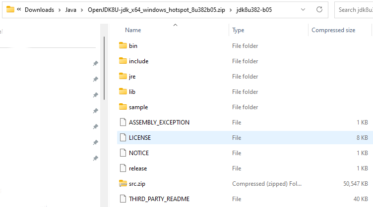
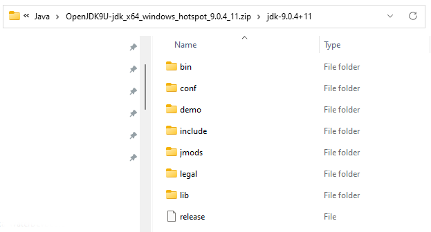
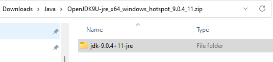
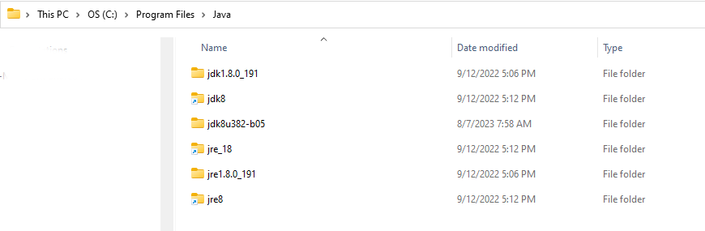
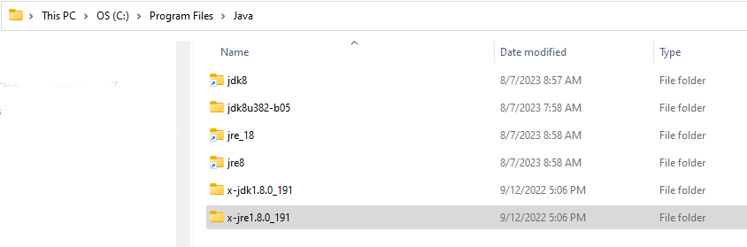
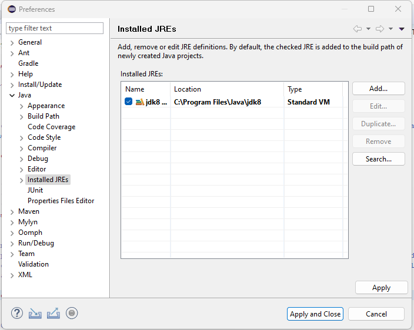
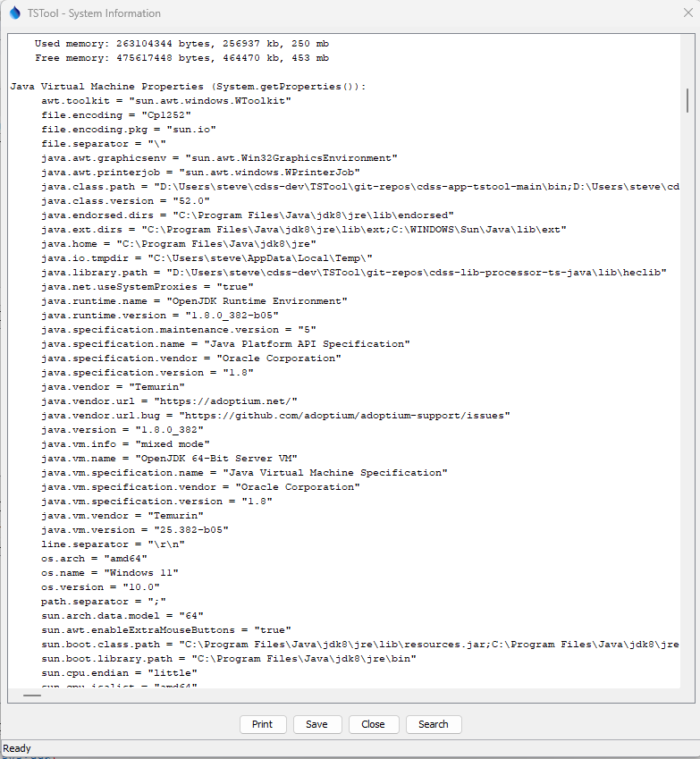

# TSTool / Development Environment / Windows OpenJDK Java 8 #

*   [Introduction](#introduction)
*   [Download OpenJDK Java 8](#download-openjdk-java-8)
*   [Install OpenJDK Java 8](#install-openjdk-java-8)
*   [Create Symbolic Links for OpenJDK Java 8](#create-symbolic-links-for-openjdk-java-8)
*   [Confirm OpenJDK Java 8 Eclipse Run Script Configuration](#confirm-openjdk-java-8-eclipse-run-script-configuration)

------

## Introduction ##

**This documentation is an archive of old documentation that was used to set up the Java 8 development environment using OpenJDK Java 8 64-bit,
used for TSTool versions >= 14.9.0 and < 15.0.0.
The documentation should only be used as a reference but not for current development.**

The links in this documentation may become unavailable as the OpenJDK web pages change.

### Download OpenJDK Java 8 ###

As of TSTool 14.9.0, TSTool was developed using OpenJDK Java.
OpenJDK is published by the OpenJDK project.
Other organizations provide enhanced versions that differ from the original OpenJDK versions and will be found
when searching for "OpenJDK downloads".
TSTool is developed using the standard OpenJDK version.

OpenJDK versions are archived and are available for download.
Unfortunately, downloads for OpenJDK can be confusing because the Oracle website does not
always use "OpenJDK" in URLs and content, and packaging for download is minimal.

See the following resources:

*   Oracle website:
    +   [OpenJDK: How to download and install prebuilt OpenJDK packages](https://openjdk.org/install/) - general instructions
    +   [Archived OpenJDK General-Availability Releases](https://jdk.java.net/archive/) - includes versions 9+
        -   The downloads include the Java Development Kit (JDK) but do not contain a separate `jre` folder
            for the Java Runtime Environment (JRE) used in deployed systems
*   AdoptOpenJDK:
    *   [AdoptOpenJDK](https://adoptopenjdk.net/releases.html) - OpenJDK download page

Use the above AdoptOpenJDK page to select the required OpenJDK version.
For example, select "OpenJDK 8 (LTS)" and "Hotspot" to download Java 8 JDK and JRE.
Make sure to download the Windows x64 bit version for 64-bit Java.
Download the `.zip` (rather than the `.msi`) file to allow more control of the installation.
The download file will have a name similar to `OpenJDK8U-jdk_x64_windows_hotspot_8u382b05.zip`
for Java 8 update `382` and build `05`, and will have contents similar to the following.
Note that the zip file contains a `jre` folder that can be distributed in the deployed environment and the `src`
folder contains unneeded source code.

**<p style="text-align: center;">

</p>**

**<p style="text-align: center;">
OpenJDK Java 8 Zip File Contents (<a href="../images/java8-1-zipfiles.png">see full-size image</a>)
</p>**

The packaging for files changed with Java 9.  The following image shows the main zip file contents for
OpenJDK 9 download file `OpenJDK9U-jdk_x64_windows_hotspot_9.0.4_11.zip`.
Note that there is no `jre` folder for the Java Runtime Environment.

**<p style="text-align: center;">

</p>**

**<p style="text-align: center;">
OpenJDK Java 9 JDK Zip File Contents (<a href="../images/java9-1-zipfiles.png">see full-size image</a>)
</p>**

The AdoptOpenJDK download page provides a separate download for JRE (the Oracle downloads page does not provide JRE downloads).
For example the `OpenJDK9U-jre_x64_windows_hotspot_9.0.4_11.zip` file contents are as follows:

**<p style="text-align: center;">

</p>**

**<p style="text-align: center;">
OpenJDK Java 9 JRE Zip File Contents (<a href="../images/java9-2-jre-zipfiles.png">see full-size image</a>)
</p>**

### Install OpenJDK Java 8 ###

The zip file(s) described in the previous section contain the necessary Java files that
can be copied to the appropriate location on the Windows computer.

For Java 8:

*   Copy the main Java folder (e.g., `jdk8u382-b05`) to `C:\Program Files\Java\jdk8u382-b05`).
*   Because the `jre` folder exists in the above folder, no additional copy is needed
    (an extra copy step is required for Java 9 and later).

The following shows older Oracle JDK (`jdk1.8.0_191`) and JRE installations with the newer OpenJDK folder (`jdk8u382-b05`).
The other folders are links that are described in the next section.

**<p style="text-align: center;">

</p>**

**<p style="text-align: center;">
Java Program Files (<a href="../images/java8-2-program-files.png">see full-size image</a>)
</p>**

### Create Symbolic Links for OpenJDK Java 8 ###

The folder containing the OpenJDK Java 8 files (`C:\Program Files\Java\jdk8u382-b05`) will be used by the Eclipse software during development,
and the JRE folder will be packaged with the TSTool installer.

The use of version-specific folder can be problematic because Eclipse Java Runtime Environment and build utilities must
be configured to use the specific version.
This may result in developers with different minor versions of Java flip-flopping repository contents.
To minimize such issues, links with generic names are created.
See the previous section for am image that illustrates the links.

If old versions of Java software exist that will not be used by other software:

*   remove old links using File Explorer,
    which will remove the links without removing the original folders.
*   rename the old folders, for example with a leading `x-` to ensure that they are not used in the development environment
    (this will break any references to the old versions,
    so it may be necessary to keep the names if other software is using the old versions)
*   if the old versions are no longer needed, they can be removed

To create new links,
open a Windows command shell with Administrator privileges and create symbolic links as shown in the following image and
summarized below.
**Exclipse seems to traverse the link and use the specific resource in its environment, showing the full path rather than the link,
but it is convenient nevertheless and is needed for scripts that use general folder names.**

```
cd \Program Files\Java
mklink /d jdk8 jdk8u382-b05
mklink /d jre8 jdk8u382-b05\jre
```

In addition, the automated build system uses JRE folder that requires another symbolic link to find the JRE to distribute with the installer.
Create the link as follows in the `C:\Program Files\Java` folder:

```
mklink /d jre_18 jdk8u382-b05\jre
```

The resulting `C:\Program Files\Java` folder will have contents similar to the following:

**<p style="text-align: center;">

</p>**

**<p style="text-align: center;">
Java Program Files (<a href="../images/java8-3-program-files-links.png">see full-size image</a>)
</p>**

If Eclipse has been configured (see the [Development Environment / Eclipse](../../eclipse/eclipse.md) configuration),
the Eclipse ***Window / Preferences*** menu can be used to check what version of Java is being used.
See the ***Java / Installed JREs*** preferences, which should look similar to the following (note the general `jdk8` folder name).

**<p style="text-align: center;">

</p>**

**<p style="text-align: center;">
Java Program Files (<a href="../images/java8-4-eclipse-preferences.png">see full-size image</a>)
</p>**

To check the Java version being used at runtime in TSTool,
use the ***Help / About TSTool*** menu and then press the ***Show Software / System Details*** button, which will show the following.

*   `java.vendor = Temurin`
*   `java.vendor.url = https://adoptium.net` - for AdoptOpenJDK
*   `java.version = 1.8.0_382` - should match the Java version configured above

**<p style="text-align: center;">

</p>**

**<p style="text-align: center;">
TSTool Java Runtime Properties (<a href="../images/java8-5-runtime-properties.png">see full-size image</a>)
</p>**

### Confirm OpenJDK Java 8 Eclipse Run Script Configuration ###

The order that Java and Eclipse are installed may vary.
These major development environment components need to be configured appropriately and it is useful to use a run script to start Eclipse.

*   [See information about the Eclipse run script](../../eclipse/eclipse.md#check-eclipse-run-script) - ensures that a standard development environment is used
