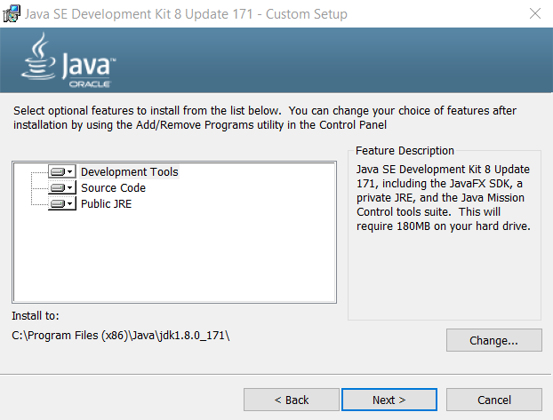

# TSTool / Development Environment / Windows Oracle Java 8 #

*   [Introduction](#introduction)
*   [Download Oracle Java 8 ](#download-oracle-java-8)
*   [Install Oracle Java 8](#install-oracle-java-8)
*   [Create Symbolic Links for Oracle Java 8](#create-symbolic-links-for-oracle-java-8)
*   [Confirm Oracle Java 8 Eclipse Run Script Configuration](#confirm-oracle-java-8-eclipse-run-script-configuration)

------

## Introduction ##

This documentation is an archive of old documentation that was used to set up the Java 8 development environment
using Oracle Java 8 through TSTool 14.8.6,
including discussion of 64-bit and 32-bit environments.

Oracle began charging a fee for Java Standard Edition as of January 2019.
TSTool development was able to continue using the free version of Oracle Java.
However, the free OpenJDK version was phased in as of TSTool 14.9.0 to avoid fees and allow Java to be updated to supported versions.

The links in this documentation may become unavailable as the Oracle web pages change.

### Download Oracle Java 8 ###

TSTool has traditionally been developed using Oracle Java.
The major Java version (8) is important and otherwise the latest minor version can be downloaded to ensure support
for recent operating systems and security patches.

Download the Java SE Development Kit from the
[Oracle Java Download Site](https://www.oracle.com/technetwork/java/javase/downloads/jdk8-downloads-2133151.html).

The 64-bit version download file will be named `jdk-8u112-windows-x64.exe` or similar.

The 32-bit version (for older versions of TSTool) is named `Windows x86` or similar and the download file will be named `jdk-8u171-windows-i586.exe` or similar.

## Install Oracle Java 8 ##

**This documentation needs to be updatd for 64-bit Java.
Edits have been made to folder locations to indicate 64-bit installation but images need to be updated.**

Run the installer from the previous step.  Administrator privileges will be required.
The following procedure may vary slightly as new Java releases are made.

**<p style="text-align: center;">

</p>**

**<p style="text-align: center;">
Java Installation - Welcome (<a href="../images/oracle-java8/java8-32-1.png">see full-size image</a>)
</p>**

Press ***Next >*** to continue.

**<p style="text-align: center;">

</p>**

**<p style="text-align: center;">
Java Installation - Custom Setup (<a href="../images/oracle-java8/java8-32-2.png">see full-size image</a>)
</p>**

Accept the defaults in the above dialog without changing.
Note that since installing the 64-bit version the installation folder is `C:\Program Files`
(older 32-bit installation used `C:\Program Files (x86)`).
Other installations of Java may already exist on the computer, which is OK.
Press ***Next >*** to continue.

**<p style="text-align: center;">

</p>**

**<p style="text-align: center;">
Java Installation - Destination Folder (<a href="../images/oracle-java8/java8-32-3.png">see full-size image</a>)
</p>**

Accept the defaults in the above dialog without changing.
Press ***Next >*** to continue.  A progress indicator will be shown.

**<p style="text-align: center;">

</p>**

**<p style="text-align: center;">
Java Installation - Complete (<a href="../images/oracle-java8/java8-32-4.png">see full-size image</a>)
</p>**

Press ***Close*** to close the above dialog.

## Create Symbolic Links for Oracle Java 8 ##

### 64-bit Java ###

The Java installation process creates files as shown in the following image (the links are created in steps below).

**<p style="text-align: center;">

</p>**

**<p style="text-align: center;">
Java Installation Folders (<a href="../images/oracle-java8/java8-64-5.png">see full-size image</a>)
</p>**

The use of version-specific folder can be problematic because Eclipse Java Runtime Environment and build utilities must
be configured to use the specific version.
This may result in developers with different minor versions of Java flip-flopping repository contents.
To minimize such issues, open a Windows command shell with Administrator privileges and create symbolic links as shown in the following image and
summarized below.
**Actualy, Exclipse seems to traverse the link and use the specific resource in its environment, showing the full path rather than the link,
but it is convenient nevertheless and is needed for the step below.**

```
mklink /d jdk8 jdk1.8.0_191
mklink /d jre8 jre1.8.0_191
```

In addition, the automated build system uses JRE folder that requires another symbolic link to find the JRE to distribute with the installer.
Create the link as follows in the `C:\Program Files\Java` folder:

```
mklink /d jre_18 jre8
```

### 32-bit Java ###

The Java installation process creates files as shown in the following image.

**<p style="text-align: center;">

</p>**

**<p style="text-align: center;">
Java Installation Folders (<a href="../images/oracle-java8/java8-32-5.png">see full-size image</a>)
</p>**

The use of version-specific folder can be problematic because Eclipse Java Runtime Environment and build utilities must
be configured to use the specific version.
This may result in developers with different minor versions of Java flip-flopping repository contents.
To minimize such issues, open a Windows command shell with Administrator privileges and create symbolic links as shown in the following image and
summarized below.
**Actualy, Exclipse seems to traverse the link and use the specific resource in its environment, showing the full path rather than the link,
but it is convenient nevertheless and is needed for the step below.**

```
mklink /d jdk8 jdk1.8.0_171
mklink /d jre8 jre1.8.0_171
```

**<p style="text-align: center;">

</p>**

**<p style="text-align: center;">
Java Symbolic Links (<a href="../images/oracle-java8/java8-32-6-link.png">see full-size image</a>)
</p>**

In addition, the automated build system uses JRE folder that requires another symbolic link to find the JRE to distribute with the installer.
Create the link as follows in the `C:\Program Files (x86)\Java` folder:

```
mklink /d jre_18 jre8
```

## Confirm Oracle Java 8 Eclipse Run Script Configuration ##

The order that Java and Eclipse are installed may vary.
These major development environment components need to be configured appropriately and it is useful to use a run script to start Eclipse.

*   [See information about the run script](eclipse.md#check-eclipse-run-scipt)

