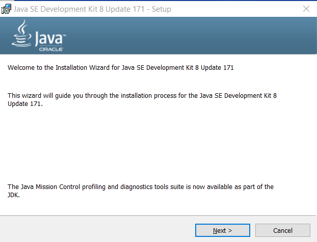
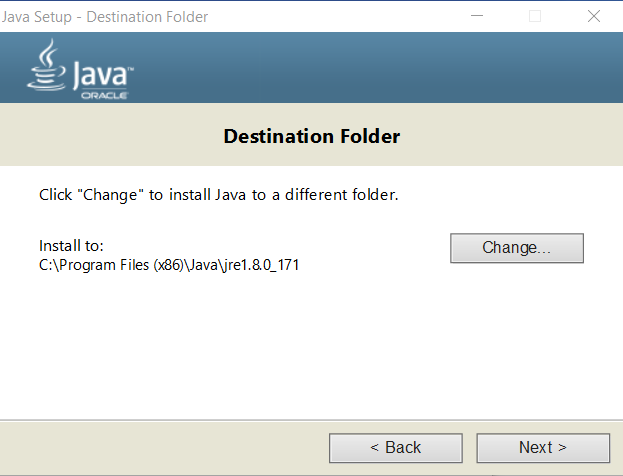
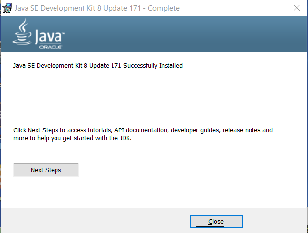
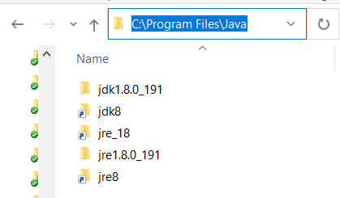
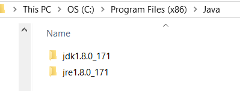
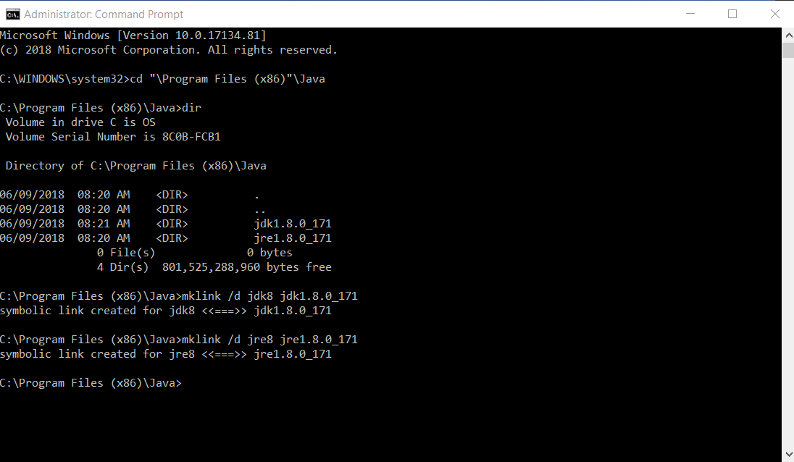

# TSTool / Development Environment / Java 8 ##

* [Introduction](#introduction)
*  [Windows](#windows)
	+ [Download Java 8](#download-java-8)
	+ [Install Java 8](#install-java-8)
	+ [Create Symbolic Links for Java 8](#ceate-symbolic-links-for-java-8)
	+ [Confirm Run Script Configuration](#confirm-run-script-configuration)
*  [Linux](#linux)

------

## Introduction ##

Java 8 is currently required for TSTool development.
Java 9 and newer versions will be evaluated and will be phased in as soon as possible,
but requires confirmation that deployed systems including Linux variants support Java 9.

As of TSTool 14.0.0, 64-bit Java is currently the default for development.
32-bit Java was previously used and supports native libraries used by some TSTool features,
in particular the HEC-DSS libraries, which are used by `ReadHecDss` and `WriteHecDss` commands.
64-bit versions of these libraries need to be integrated with TSTool in order to fully support 64-bit development environment.
If 32-bit features are needed, an older version of TSTool can be installed.

It is possible to change the run-time Java for deployed TSTool software by swapping
the Java Runtime Environment (JRE) that is distributed with TSTool.

##  Windows ##

### Download Java 8 ###

TSTool has traditionally been developed using Oracle Java.
The major version (8) is important and otherwise the latest minor version can be downloaded to ensure support
for recent operating systems and for security patches.

Download the Java SE Development Kit from the
[Oracle Java Download Site](http://www.oracle.com/technetwork/java/javase/downloads/jdk8-downloads-2133151.html).

The 64-bit version download file will be named `jdk-8u112-windows-x64.exe` or similar.

The 32-bit version (for older versions of TSTool) is named `Windows x86` or similar and the download file will be named `jdk-8u171-windows-i586.exe` or similar.

### Install Java 8 ###

**This documentation needs to be updatd for 64-bit Java.
Edits have been made to folder locations to indicate 64-bit installation but images need to be updated.**

Run the installer from the previous step.  Administrator privileges will be required.
The following procedure may vary slightly as new Java releases are made.

**<p style="text-align: center;">

</p>**

**<p style="text-align: center;">
Java Installation - Welcome (<a href="../images/java8-32-1.png">see full-size image</a>)
</p>**

Press ***Next >*** to continue.

**<p style="text-align: center;">

</p>**

**<p style="text-align: center;">
Java Installation - Custom Setup (<a href="../images/java8-32-2.png">see full-size image</a>)
</p>**

Accept the defaults in the above dialog without changing.
Note that since installing the 64-bit version the installation folder is `C:\Program Files`
(older 32-bit installation used `C:\Program Files (x86)`).
Other installations of Java may already exist on the computer, which is OK.
Press ***Next >*** to continue.

**<p style="text-align: center;">

</p>**

**<p style="text-align: center;">
Java Installation - Destination Folder (<a href="../images/java8-32-3.png">see full-size image</a>)
</p>**

Accept the defaults in the above dialog without changing.
Press ***Next >*** to continue.  A progress indicator will be shown.

**<p style="text-align: center;">

</p>**

**<p style="text-align: center;">
Java Installation - Complete (<a href="../images/java8-32-4.png">see full-size image</a>)
</p>**

Press ***Close*** to close the above dialog.

### Create Symbolic Links for Java 8 ###

#### 64-bit Java ####

The Java installation process creates files as shown in the following image (the links are created in steps below).

**<p style="text-align: center;">

</p>**

**<p style="text-align: center;">
Java Installation Folders (<a href="../images/java8-64-5.png">see full-size image</a>)
</p>**

The use of version-specific folder can be problematic because Eclipse Java Runtime Environment and build utilities must
be configured to use the specific version.
This may result in developers with different minor versions of Java flip-flopping repository contents.
To minimize such issues, open a Windows command shell with Administrator privileges and create symbolic links as shown in the following image and
summarized below.
**Actualy, Exclipse seems to traverse the link and use the specific resource in its environment, showing the full path rather than the link,
but it is convenient nevertheless and is needed for the step below.**

```
mklink /d jdk8 jdk1.8.0_191
mklink /d jre8 jre1.8.0_191
```

In addition, the automated build system uses JRE folder that requires another symbolic link to find the JRE to distribute with the installer.
Create the link as follows in the `C:\Program Files\Java` folder:

```
mklink /d jre_18 jre8
```

#### 32-bit Java ####

The Java installation process creates files as shown in the following image.

**<p style="text-align: center;">

</p>**

**<p style="text-align: center;">
Java Installation Folders (<a href="../images/java8-32-5.png">see full-size image</a>)
</p>**

The use of version-specific folder can be problematic because Eclipse Java Runtime Environment and build utilities must
be configured to use the specific version.
This may result in developers with different minor versions of Java flip-flopping repository contents.
To minimize such issues, open a Windows command shell with Administrator privileges and create symbolic links as shown in the following image and
summarized below.
**Actualy, Exclipse seems to traverse the link and use the specific resource in its environment, showing the full path rather than the link,
but it is convenient nevertheless and is needed for the step below.**

```
mklink /d jdk8 jdk1.8.0_171
mklink /d jre8 jre1.8.0_171
```

**<p style="text-align: center;">

</p>**

**<p style="text-align: center;">
Java Symbolic Links (<a href="../images/java8-32-6-link.png">see full-size image</a>)
</p>**

In addition, the automated build system uses JRE folder that requires another symbolic link to find the JRE to distribute with the installer.
Create the link as follows in the `C:\Program Files (x86)\Java` folder:

```
mklink /d jre_18 jre8
```

### Confirm Run Script Configuration ###

The order that Java and Eclipse are installed may vary.
These major development environment components need to be configured appropriately and it is useful to use a run script to start Eclipse.

* [See information about the run script](eclipse.md#check-eclipse-run-scipt)

##  Linux ##

This documentation was prepared while installing Java 8 on a Debian Stretch Linux VirtualBox virtual machine.
Other environments will be similar.

Java 8 was installed using the following command:

```
$ sudo apt-get install openjdk-8-jdk
```
