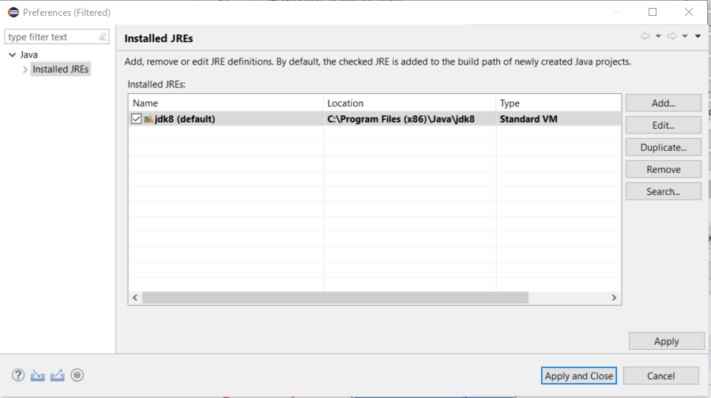
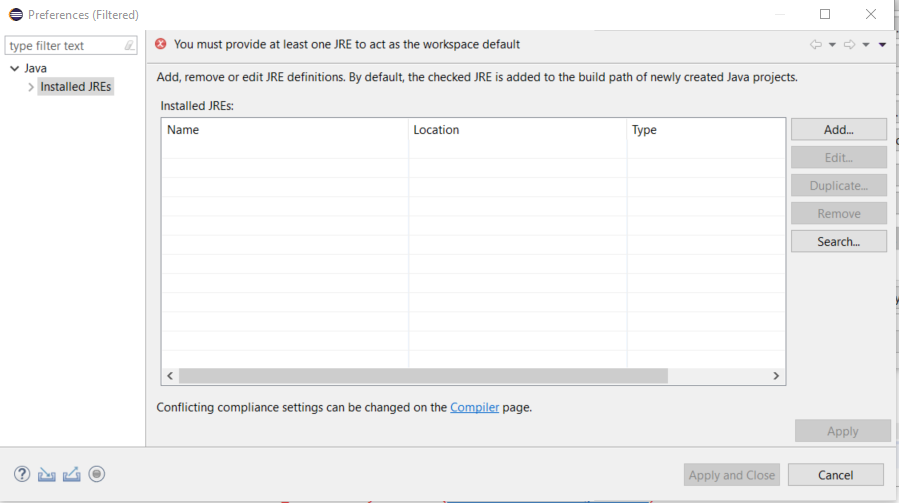
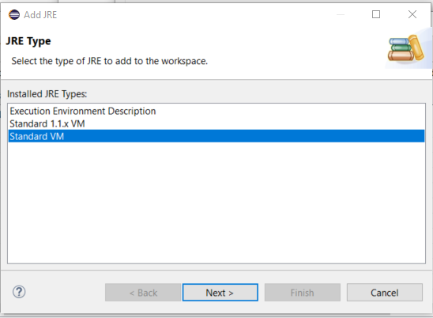
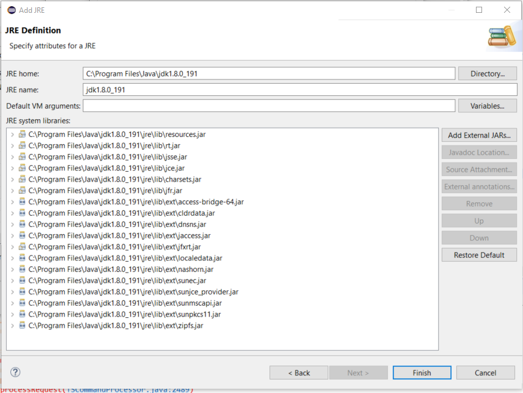
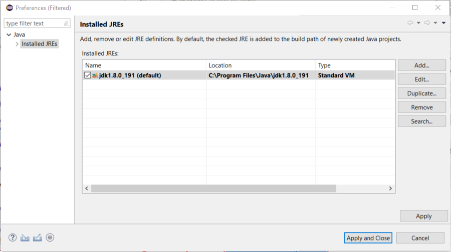
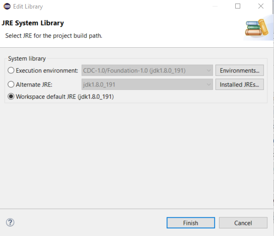
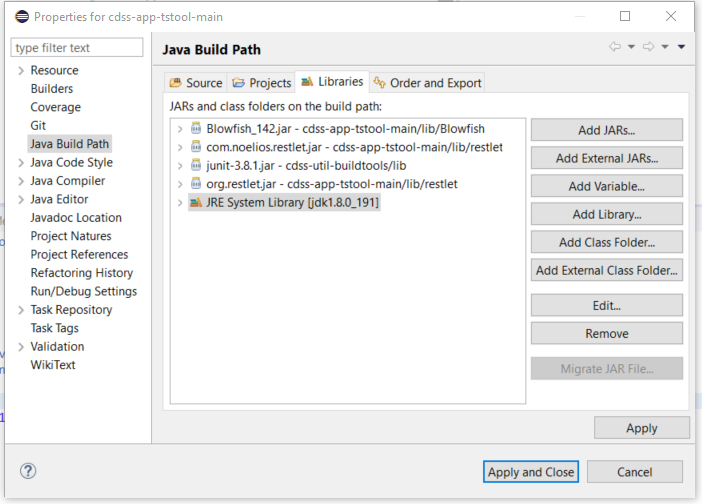

# TSTool / New Developer Setup / Additional Eclipse Configuration for Eclipse 2019-03 #

This is an archive of documentation for Eclipse configuration
for Eclipse 2019-03 and Java 8.
The documentation should not be used for current development.

### Additional Eclipse Configuration

It may be necessary to perform additional Eclipse configuration,
in particular to ensure that the proper Java version is used with development.

**The following documentation was created during updates from 32-bit to 64-bit Java 8 and to Eclipse 2019-03.**

The `cdss-app-tstool-main` project in Eclipse has the following JRE configuration.

*   ***Project / Properties / Java Build Path***
*   ***Libraries*** tab
*   ***JRE System Library*** - double click on it
*   Select ***Workspace default JRE*** radio button
*   Select ***Installed JREs...*** button

It may appear as follows since was previously configured to use the 32-bit JRE.
If no installed Java is listed, add as shown in the next step.

**

**

**

Installed Java Runtime Environments (<a href="../images/installed-jre-0.png">see full-size image</a>)

**

Use the ***Remove*** button to remove the JRE since the 64-bit version will have the same name (but different path).
A warning will be shown as follows.

**

**

**

JRE Remove Warning (<a href="../images/installed-jre-1.png">see full-size image</a>)

**

Use the ***Add...*** button.

**

**

**

Add JRE (<a href="../images/installed-jre-2.png">see full-size image</a>)

**

Browse to the `C:\Program Files\Java\jdk8` folder that was configured as a symbolic link when Java was installed.
The dialog automatically follows the link and uses the more specific folder.

**

**

**

JRE Definition (<a href="../images/installed-jre-3.png">see full-size image</a>)

**

Press ***Finish***.

**

**

**

Installed JREs After Adding (<a href="../images/installed-jre-4.png">see full-size image</a>)

**

Accept with ***Finish*** and then ***Apply and Close***.
Then the following is shown.

**

**

**

JRE System Library (<a href="../images/installed-jre-5.png">see full-size image</a>)

**

Press ***Finish***.

**

**

**

Java Build Path (<a href="../images/installed-jre-6.png">see full-size image</a>)

**

Press ***Apply and Close***.

Do a clean build with ***Projects / Clean...***.

Run TSTool from Eclipse and use ***Help / About*** and then ***Show Software/System Details***.
The `Java Virtual Machine Properties` shows `os.arch = "amd64"`, which indicates 64-bit.
