# TSTool / New Developer Setup / Overview #

This documentation is for software developers that are members of the core TSTool team and others who
have an interest in contributing to the TSTool software project.
It is recommended that the TSTool development environment should follow these setup instructions, which are
consistent with the [Development Environment](../dev-env/overview.md) and [Initial Project Setup](../project-init/overview.md) documentation.
The [standard development folder structure](../project-init/overview.md#development-files-structure)
should be followed to minimize potential for issues,
especially given the number of components and setup steps.
All of this documentation is consistent with the recommended development environment.

This documentation and development environment are also consistent with other CDSS Java software development environments.

The intent of this documentation is to completely document setup steps and allow new developers to comment on this documentation
so that it can be improved for other developers. The following steps need to occur to set up a new developer's environment.
Links to other documentation are included to provide more information and "(**see details below**)" is used to indicate that
specific instructions are included below (rather than immediately linking to other pages from the following outline).
After reading instructions for a step, use "back" to return to this outline so that setup instructions can be followed in the proper sequence.
**Bold comments** indicate which steps are required and which are optional.

1.  **Required:** [Machine for Development](../dev-env/machine.md) - need a suitable computer
2.  **Required:** [Create folder for development files](#create-folder-for-development-files) - where development will occur (**see details below**)
3.  **Required (if not already installed):** Development Environment software install part 1 (version control)
    *   [Development Environment / Git](../dev-env/git.md) - install Git software so the repositories can be cloned
4.  **Required:** [Clone Git Repositories](#clone-git-repositories) - clone the repositories to get access to all files (**see details below**)
5.  **Required:** Development Environment software install part 2 (Java development tools)
    *   **Required:** [Development Environment / Java](../dev-env/java.md) - make sure the correct Java version is available on system
    *   **Required (if not already installed):** [Development Environment / Eclipse](../dev-env/eclipse.md) - install Eclipse for use as IDE
    *   **Optional:** [Development Environment / KDiff3](../dev-env/kdiff3.md) - install software to facilitate comparing files
        **(highly useful and can be used with Git)**
    *   **Optional:** [Development Environment / NSIS](../dev-env/nsis.md) - install software to create TSTool software installer
    *   **Optional:** [Development Environment / launch4j](../dev-env/launch4j.md) - install software to create TSTool software installer
6.  **Required:** Eclipse Workspace Setup (interactive development environment)
    *   **Required:** [Create Eclipse Workspace Folder](#create-eclipse-workspace-folder) - simple manual step (***see details below***)
    *   **Required:** [Import the Existing Eclipse TSTool Projects from the Git Repository Folders](#import-the-existing-eclipse-tstool-projects-from-the-git-repository-folders):
        -   [Import Code Repositories](#import-code-repositories)
        -   [Additional Eclipse Configuration](#additional-eclipse-configuration)
            from Git repository working files (**see details below**)
7.  **Optional:** Development Environment software install part 3 (documentation tools), **(install if will view and edit documentation within the development environment)**
    *   [Development Environment / Python and pip](../dev-env/python.md) - install Python, which is needed by MkDocs
    *   [Development Environment / MkDocs](../dev-env/mkdocs.md) - install MkDocs to view/edit full documentation locally.
    See [Development Tasks / Documenting](../dev-tasks/overview.md#documenting)
    for instructions on viewing documentation.
8.  [Next Steps - Development Tasks](#next-steps-development-tasks) - to compile, edit, run, etc.

The following sections are referenced from the above outline.

-------------

## Create Folder for Development Files ##

Create a development home folder in user files consistent with the
[repository Development Environment Folder Structure](https://github.com/OpenCDSS/cdss-app-tstool-main#development-environment-folder-structure)
(see also the [initial project setup](../project-init/overview.md)).
This is an umbrella folder for all TSTool development files,
including software tools that are installed locally (as appropriate).

It is assumed that development will occur within a developer's home folder on the computer in order to provide separation from the
work of other developers on the computer.
Tools such as Git rely on a unique identity for developers in order to properly track edits to files
and working in a shared space can be problematic.
After the folder is created, additional instructions describe how to install development files into the folder.

###  Cygwin ###

[Cygwin icon](../resources.md#cygin) is a useful software platform to provide Linux programs on a Windows computer.
It may be convenient to use Cygwin for some work, such as running command-line utilities,
although the development environment has focused on Windows and Git Bash.

If using Cygwin, do the following using a terminal window. Note that the syntax `~` indicates the home folder for Bash shell
and is equivalent to the `$HOME` environment variable location.
The following uses the Windows location for user files (rather than Cygwin location `/home/user`,
which are typically stored in the Windows Cygwin install folder `C:\cygwin64\home` folder),
which allows Eclipse and other tools to work in Windows on the files accessed via Cygwin.

```bash
$ cd /cygdrive/c/Users/user
$ mkdir cdss-dev
$ cd cdss-dev/
$ mkdir TSTool
```

###  Linux ###

Do the following using a terminal window. Note that the syntax `~` indicates the home folder and is equivalent to the `$HOME` environment
variable location.

```bash
$ cd
$ mkdir cdss-dev
$ cd ~/cdss-dev/
$ mkdir TSTool
```

###  Windows ###

Do the following in a Windows command shell, Git CMD, or perform the equivalent actions in file explorer, or Git Bash.

```com
> C:
> cd \Users\userName
> mkdir cdss-dev
> cd cdss-dev
> mkdir TSTool
```

*Press* ***back*** *in the browser to return to the outline.*

## Clone Git Repositories ##

The GitHub repositories described in the [standard development folder structure](../project-init/overview.md#development-files-structure)
contain various components needed for TSTool development.
Each repository will be cloned into a local folder.

If Eclipse is used for development (recommended),
the repositories will be imported into the Eclipse workspace as Java projects (code) and general projects in a later step.

If prompted when using `git clone`, specify the GitHub account credentials.

###  Clone the repository files (Cygwin) ###

**It is recommened that a Windows development environment is used including Git Bash.
Cygwin can be used for repositories that are not included in Eclipse,
such as this developer documentation (`cdss-app-tstool-doc-dev`),
new MkDocs user documentation (`cdss-app-tstool-doc-user`),
and test repository (`cdss-app-tstool-test`).
However, experience has shown that mixing Git Bash and Cygwin results in
excessive Git messages about end of line, and file execute permission file mode is not handed the same.
Using Windows/Git Bash for all repositories avoids issues with the filemode executable property.**

It may be possible to fully develop TSTool in a Cygwin environment,
but this is not a focus of this documentation.

Follow the instructions for Linux (see below) but change the first step to the following to ensure that
the shared Cygwin/Windows file location is used.

```bash
$ cd /cygdrive/c/Users/user/cdss-dev/TSTool
```

###  Clone the repository files (Linux) ###

The following assumes that the Bash shell is used.
If the `~` notation is not recognized as the home folder, use `$HOME`.

```bash
$ cd ~/cdss-dev/TSTool
$ mkdir git-repos
$ cd git-repos
$ git clone https://github.com/OpenCDSS/cdss-app-tstool-main.git
$ cd cdss-app-tstool-main/build-util
$ ./git-clone-all-tstool.sh
```

The above will clone all repositories that comprise TSTool.

###  Clone the repository files (Windows) ###

Use a Windows Git client.  Git Bash is recommended.
Perform the following steps.
Output is shown to illustrate typical behavior for user `sam`; however,
output may not be exact as software is updated over time.
Cloning all the repositories may take several minutes to complete.

```com
$ cd
$ cd cdss-dev/TSTool
$ mkdir git-repos
$ cd git-repos
$ git clone https://github.com/OpenCDSS/cdss-app-tstool-main.git
$ cd cdss-app-tstool-main/build-util
$ ./git-clone-all-tstool.sh
operatingSystem=mingw (used to check for Cygwin and filemode compatibility)

Clone all repositories for the product to set up a new developer environment.
The following is from /c/Users/sam/cdss-dev/TSTool/git-repos/cdss-app-tstool-main/build-util/product-repo-list.txt

--------------------------------------------------------------------------------
# Repositories that comprise TSTool
# - assumes that local folder name will match the repository name
cdss-app-tstool-doc
cdss-app-tstool-doc-dev
cdss-app-tstool-doc-user
cdss-app-tstool-main
cdss-app-tstool-test
cdss-archive-nsis-2.46
cdss-lib-cdss-java
cdss-lib-common-java
cdss-lib-dmi-hydrobase-java
cdss-lib-dmi-hydrobase-rest-java
cdss-lib-dmi-nwsrfs-java
cdss-lib-dmi-riversidedb-java
cdss-lib-dmi-satmonsys-java
cdss-lib-models-java
cdss-lib-processor-ts-java
cdss-util-buildtools
--------------------------------------------------------------------------------

All repositories that don't already exist will be cloned to /c/Users/sam/cdss-dev/TSTool/git-repos.
Repositories will be cloned using root URL https://github.com/OpenCDSS
You may be prompted to enter credentials.
Continue [y/n]?: y
================================================================================
Cloning repository:  cdss-app-tstool-doc
Repository folder:  /c/Users/sam/cdss-dev/TSTool/git-repos/cdss-app-tstool-doc
Repository Url:  https://github.com/OpenCDSS/cdss-app-tstool-doc
Cloning into 'cdss-app-tstool-doc'...
remote: Enumerating objects: 6, done.
remote: Counting objects: 100% (6/6), done.
remote: Compressing objects: 100% (5/5), done.
remote: Total 11321 (delta 1), reused 4 (delta 1), pack-reused 11315
Receiving objects: 100% (11321/11321), 348.35 MiB | 5.22 MiB/s, done.
Resolving deltas: 100% (5302/5302), done.
Checking out files: 100% (1942/1942), done.
================================================================================
Cloning repository:  cdss-app-tstool-doc-dev
Repository folder:  /c/Users/sam/cdss-dev/TSTool/git-repos/cdss-app-tstool-doc-dev
Repository Url:  https://github.com/OpenCDSS/cdss-app-tstool-doc-dev
Cloning into 'cdss-app-tstool-doc-dev'...
remote: Enumerating objects: 81, done.
remote: Counting objects: 100% (81/81), done.
remote: Compressing objects: 100% (52/52), done.
remote: Total 414 (delta 3), reused 42 (delta 3), pack-reused 333
Receiving objects: 100% (414/414), 1.62 MiB | 4.22 MiB/s, done.
Resolving deltas: 100% (116/116), done.
================================================================================
Cloning repository:  cdss-app-tstool-doc-user
Repository folder:  /c/Users/sam/cdss-dev/TSTool/git-repos/cdss-app-tstool-doc-user
Repository Url:  https://github.com/OpenCDSS/cdss-app-tstool-doc-user
Cloning into 'cdss-app-tstool-doc-user'...
remote: Enumerating objects: 521, done.
remote: Counting objects: 100% (521/521), done.
remote: Compressing objects: 100% (502/502), done.
remote: Total 2839 (delta 74), reused 200 (delta 8), pack-reused 2318
Receiving objects: 100% (2839/2839), 21.11 MiB | 5.82 MiB/s, done.
Resolving deltas: 100% (847/847), done.
Checking out files: 100% (987/987), done.
================================================================================
Cloning repository:  cdss-app-tstool-main
Repository folder:  /c/Users/sam/cdss-dev/TSTool/git-repos/cdss-app-tstool-main
Repository Url:  https://github.com/OpenCDSS/cdss-app-tstool-main
Repo folder already exists so skipping:  /c/Users/sam/cdss-dev/TSTool/git-repos/cdss-app-tstool-main
================================================================================
Cloning repository:  cdss-app-tstool-test
Repository folder:  /c/Users/sam/cdss-dev/TSTool/git-repos/cdss-app-tstool-test
Repository Url:  https://github.com/OpenCDSS/cdss-app-tstool-test
Cloning into 'cdss-app-tstool-test'...
remote: Enumerating objects: 6, done.
remote: Counting objects: 100% (6/6), done.
remote: Compressing objects: 100% (5/5), done.
remote: Total 17227 (delta 1), reused 4 (delta 1), pack-reused 17221
Receiving objects: 100% (17227/17227), 32.25 MiB | 7.77 MiB/s, done.
Resolving deltas: 100% (9965/9965), done.
Checking out files: 100% (4994/4994), done.
================================================================================
Cloning repository:  cdss-archive-nsis-2.46
Repository folder:  /c/Users/sam/cdss-dev/TSTool/git-repos/cdss-archive-nsis-2.46
Repository Url:  https://github.com/OpenCDSS/cdss-archive-nsis-2.46
Cloning into 'cdss-archive-nsis-2.46'...
remote: Enumerating objects: 5, done.
remote: Counting objects: 100% (5/5), done.
remote: Compressing objects: 100% (4/4), done.
remote: Total 907 (delta 1), reused 3 (delta 1), pack-reused 902
Receiving objects: 100% (907/907), 6.60 MiB | 6.18 MiB/s, done.
Resolving deltas: 100% (212/212), done.
Checking out files: 100% (866/866), done.
================================================================================
Cloning repository:  cdss-lib-cdss-java
Repository folder:  /c/Users/sam/cdss-dev/TSTool/git-repos/cdss-lib-cdss-java
Repository Url:  https://github.com/OpenCDSS/cdss-lib-cdss-java
Cloning into 'cdss-lib-cdss-java'...
remote: Enumerating objects: 20, done.
remote: Counting objects: 100% (20/20), done.
remote: Compressing objects: 100% (12/12), done.
remote: Total 391 (delta 4), reused 15 (delta 3), pack-reused 371
Receiving objects: 100% (391/391), 857.13 KiB | 708.00 KiB/s, done.
Resolving deltas: 100% (132/132), done.
================================================================================
Cloning repository:  cdss-lib-common-java
Repository folder:  /c/Users/sam/cdss-dev/TSTool/git-repos/cdss-lib-common-java
Repository Url:  https://github.com/OpenCDSS/cdss-lib-common-java
Cloning into 'cdss-lib-common-java'...
remote: Enumerating objects: 633, done.
remote: Counting objects: 100% (633/633), done.
remote: Compressing objects: 100% (509/509), done.
remote: Total 11022 (delta 168), reused 241 (delta 117), pack-reused 10389
Receiving objects: 100% (11022/11022), 16.51 MiB | 5.47 MiB/s, done.
Resolving deltas: 100% (7266/7266), done.
Checking out files: 100% (788/788), done.
================================================================================
Cloning repository:  cdss-lib-dmi-hydrobase-java
Repository folder:  /c/Users/sam/cdss-dev/TSTool/git-repos/cdss-lib-dmi-hydrobase-java
Repository Url:  https://github.com/OpenCDSS/cdss-lib-dmi-hydrobase-java
Cloning into 'cdss-lib-dmi-hydrobase-java'...
remote: Enumerating objects: 260, done.
remote: Counting objects: 100% (260/260), done.
remote: Compressing objects: 100% (200/200), done.
remote: Total 2675 (delta 119), reused 88 (delta 53), pack-reused 2415
Receiving objects: 100% (2675/2675), 11.78 MiB | 4.04 MiB/s, done.
Resolving deltas: 100% (1608/1608), done.
Checking out files: 100% (457/457), done.
================================================================================
Cloning repository:  cdss-lib-dmi-hydrobase-rest-java
Repository folder:  /c/Users/sam/cdss-dev/TSTool/git-repos/cdss-lib-dmi-hydrobase-rest-java
Repository Url:  https://github.com/OpenCDSS/cdss-lib-dmi-hydrobase-rest-java
Cloning into 'cdss-lib-dmi-hydrobase-rest-java'...
remote: Enumerating objects: 88, done.
remote: Counting objects: 100% (88/88), done.
remote: Compressing objects: 100% (50/50), done.
remote: Total 1629 (delta 46), reused 51 (delta 29), pack-reused 1541
Receiving objects: 100% (1629/1629), 2.01 MiB | 4.57 MiB/s, done.
Resolving deltas: 100% (838/838), done.
================================================================================
Cloning repository:  cdss-lib-dmi-nwsrfs-java
Repository folder:  /c/Users/sam/cdss-dev/TSTool/git-repos/cdss-lib-dmi-nwsrfs-java
Repository Url:  https://github.com/OpenCDSS/cdss-lib-dmi-nwsrfs-java
Cloning into 'cdss-lib-dmi-nwsrfs-java'...
remote: Enumerating objects: 6, done.
remote: Counting objects: 100% (6/6), done.
remote: Compressing objects: 100% (5/5), done.
remote: Total 961 (delta 1), reused 4 (delta 1), pack-reused 955
Receiving objects: 100% (961/961), 1.02 MiB | 1.44 MiB/s, done.
Resolving deltas: 100% (471/471), done.
================================================================================
Cloning repository:  cdss-lib-dmi-riversidedb-java
Repository folder:  /c/Users/sam/cdss-dev/TSTool/git-repos/cdss-lib-dmi-riversidedb-java
Repository Url:  https://github.com/OpenCDSS/cdss-lib-dmi-riversidedb-java
Cloning into 'cdss-lib-dmi-riversidedb-java'...
remote: Enumerating objects: 6, done.
remote: Counting objects: 100% (6/6), done.
remote: Compressing objects: 100% (5/5), done.
remote: Total 859 (delta 1), reused 4 (delta 1), pack-reused 853
Receiving objects: 100% (859/859), 7.59 MiB | 5.54 MiB/s, done.
Resolving deltas: 100% (497/497), done.
================================================================================
Cloning repository:  cdss-lib-dmi-satmonsys-java
Repository folder:  /c/Users/sam/cdss-dev/TSTool/git-repos/cdss-lib-dmi-satmonsys-java
Repository Url:  https://github.com/OpenCDSS/cdss-lib-dmi-satmonsys-java
Cloning into 'cdss-lib-dmi-satmonsys-java'...
remote: Enumerating objects: 6, done.
remote: Counting objects: 100% (6/6), done.
remote: Compressing objects: 100% (5/5), done.
remote: Total 508 (delta 1), reused 4 (delta 1), pack-reused 502
Receiving objects: 100% (508/508), 2.18 MiB | 3.75 MiB/s, done.
Resolving deltas: 100% (245/245), done.
================================================================================
Cloning repository:  cdss-lib-models-java
Repository folder:  /c/Users/sam/cdss-dev/TSTool/git-repos/cdss-lib-models-java
Repository Url:  https://github.com/OpenCDSS/cdss-lib-models-java
Cloning into 'cdss-lib-models-java'...
remote: Enumerating objects: 309, done.
remote: Counting objects: 100% (309/309), done.
remote: Compressing objects: 100% (137/137), done.
remote: Total 2845 (delta 203), reused 216 (delta 171), pack-reused 2536
Receiving objects: 100% (2845/2845), 9.69 MiB | 5.01 MiB/s, done.
Resolving deltas: 100% (1978/1978), done.
================================================================================
Cloning repository:  cdss-lib-processor-ts-java
Repository folder:  /c/Users/sam/cdss-dev/TSTool/git-repos/cdss-lib-processor-ts-java
Repository Url:  https://github.com/OpenCDSS/cdss-lib-processor-ts-java
Cloning into 'cdss-lib-processor-ts-java'...
remote: Enumerating objects: 693, done.
remote: Counting objects: 100% (693/693), done.
remote: Compressing objects: 100% (241/241), done.
remote: Total 19497 (delta 489), reused 569 (delta 444), pack-reused 18804
Receiving objects: 100% (19497/19497), 63.42 MiB | 6.01 MiB/s, done.
Resolving deltas: 100% (12836/12836), done.
Checking out files: 100% (899/899), done.
================================================================================
Cloning repository:  cdss-util-buildtools
Repository folder:  /c/Users/sam/cdss-dev/TSTool/git-repos/cdss-util-buildtools
Repository Url:  https://github.com/OpenCDSS/cdss-util-buildtools
Cloning into 'cdss-util-buildtools'...
remote: Enumerating objects: 7, done.
remote: Counting objects: 100% (7/7), done.
remote: Compressing objects: 100% (6/6), done.
remote: Total 1454 (delta 2), reused 4 (delta 1), pack-reused 1447
Receiving objects: 100% (1454/1454), 13.64 MiB | 6.01 MiB/s, done.
Resolving deltas: 100% (598/598), done.
Checking out files: 100% (525/525), done.
================================================================================

After cloning, /c/Users/sam/cdss-dev/TSTool/git-repos contains:
cdss-app-tstool-doc
cdss-app-tstool-doc-dev
cdss-app-tstool-doc-user
cdss-app-tstool-main
cdss-app-tstool-test
cdss-archive-nsis-2.46
cdss-lib-cdss-java
cdss-lib-common-java
cdss-lib-dmi-hydrobase-java
cdss-lib-dmi-hydrobase-rest-java
cdss-lib-dmi-nwsrfs-java
cdss-lib-dmi-riversidedb-java
cdss-lib-dmi-satmonsys-java
cdss-lib-models-java
cdss-lib-processor-ts-java
cdss-util-buildtools
```

If Windows command prompt is used, then the `git-clone-all-tstool.sh` script cannot
be run and all repositories must be manually cloned.
In this case, do the following **instead of the above**:

```com
> C:
> cd \Users\user\cdss-dev\TSTool
> mkdir git-repos
> cd git-repos
> git clone https://github.com/OpenCDSS/cdss-app-tstool-doc.git
> git clone https://github.com/OpenCDSS/cdss-app-tstool-doc-dev.git
> git clone https://github.com/OpenCDSS/cdss-app-tstool-doc-user.git
> git clone https://github.com/OpenCDSS/cdss-app-tstool-main.git
> git clone https://github.com/OpenCDSS/cdss-app-tstool-test.git
> git clone https://github.com/OpenCDSS/cdss-lib-cdss-java.git
> git clone https://github.com/OpenCDSS/cdss-lib-common-java.git
> git clone https://github.com/OpenCDSS/cdss-lib-dmi-hydrobase-java.git
> git clone https://github.com/OpenCDSS/cdss-lib-dmi-nwsrfs-java.git
> git clone https://github.com/OpenCDSS/cdss-lib-dmi-riversidedb-java.git
> git clone https://github.com/OpenCDSS/cdss-lib-dmi-satmonsys-java.git
> git clone https://github.com/OpenCDSS/cdss-lib-models-java.git
> git clone https://github.com/OpenCDSS/cdss-lib-processor-ts-java.git
> git clone https://github.com/OpenCDSS/cdss-util-buildtools.git
```

The resulting files should match the [Development Files Structure](../project-init/overview.md#development-files-structure).

*Press* ***back*** *in the browser to return to the outline.*

## Create Eclipse Workspace Folder ##

This step creates the `eclipse-workspace` workspace folder where Eclipse saves its files to manage the TSTool software, 
as discussed in the [Development Files Structure](../project-init/overview.md#development-files-structure).

The recommended Eclipse workspace folder for different environments is as follows:

*    Linux:  the workspace folder is `/cygdrive/c/Users/user/cdss-dev/TSTool/eclipse-workspace`
*    Linux:  the workspace folder is `~/cdss-dev/TSTool/eclipse-workspace`
*    Windows: the workspace folder is `C:\Users\user\cdss-dev\TSTool\eclipse-workspace`

The folder can be created on the command line or with file system tool.  Or, create in Eclipse as shown below.

###  Windows ###

Git Bash can be used to create the workspace folder, as follows.
Note that this folder does not exist in a Git repository folder because Eclipse workspace files are dynamic
and don't need to be committed to the repository.

```sh
$ cd ~/cdss-dev/TSTool
$ mkdir eclipse-workspace
```

Start Eclipse by running the [Eclipse run script](../project-init/eclipse-run-script.md) in a Windows
command prompt window as shown below.
This script can be run any time Eclipse needs to be run.
It may also be possible to run the batch file from Git Bash but this has not been fully verified.

```bash
> C:
> cd \Users\user\cdss-dev\TSTool\git-repos\cdss-app-tstool-main\build-util
> run-eclipse-win64.cmd
```

Open the workspace in Eclipse in preparation of adding the code project from the Git repository in the next step.
If the `eclipse-workspace` folder does not exist, it can be created using Eclipse dialog.

Select a workspace as shown in the following figure.
If the `eclipse-workspace` folder was not created previously, it can be created via the eclipse dialog.

**<p style="text-align: center;">
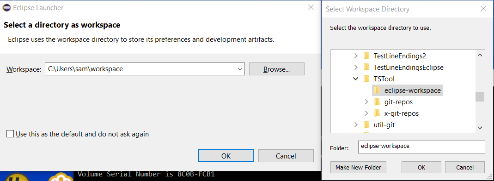
</p>**

**<p style="text-align: center;">
Select TSTool Workspace Folder (<a href="../images/eclipse-workspace-select.png">see full-size image</a>)
</p>**

The Eclipse workspace folder is identified by a `.metadata` folder, which will be hidden on Linux.

*Press* ***back*** *in the browser to return to the outline.*

## Import the Existing Eclipse TSTool Projects from the Git Repository Folders ##

**This documentation was originally written with an older version of the development environment.
The process for newer Eclipse will be similar but may have changed.**

The TSTool repositories each correspond to discrete components that must be imported into the TSTool Eclipse workspace.
The development environment does not currently use
[Maven](https://www.eclipse.org/m2e/), which is a tool that helps with library dependencies and build processes.
Instead, required third-party libraries are committed to the repository as jar files and are updated periodically.
Upgrading to Maven would be a major change in the development environment and may be implemented in the future.
Currently, Eclipse `.project` files are committed to each repository,
which allows the repository folders to be imported and be recognized as projects by Eclipse.

The repositories fall into four categories, which are discussed in the following sections.
All of the repositories obviously use Git for version control
(Eclipse generally detects this automatically when a project is imported and shows a repository icon decorator on the project folder and files).

1.  Code repositories with names ending with `java` are treated as Java projects.
2.  The CDSS build utility repository `cdss-util-buildtools` is treated as a general project and is currently required to create the software installer.
3.  The TSTool function test repository `cdss-app-tstool-test` is treated as a general project and is useful to import into Eclipse.
4.  Documentation repositories with `doc` in names can be treated as general projects and do not
    need to be imported because their files are typically edited outside of Eclipse.
    Eclipse can be used to edit these files but it can be problematic.

### Import Code Repositories ###

After the initial Eclipse workspace is selected, import the following repositories by following the same general procedure indicated below:

*   `cdss-app-tstool-doc` - not typically edited in Eclipse, but useful to see
*   `cdss-app-tstool-main`
*   `cdss-app-tstool-test` - may not be edited in Eclipse, but useful to see
*   `cdss-lib-cdss-java`
*   `cdss-lib-common-java`
*   `cdss-lib-dmi-hydrobase-java`
*   `cdss-lib-dmi-hydrobase-rest-java`
*   `cdss-lib-dmi-nwsrfs-java`
*   `cdss-lib-models-java`
*   `cdss-lib-processor-ts-java`
*   `cdss-util-buildtools`

The initial workspace will be similar to the following (if necessary, close the ***Welcome*** tab).
Use the ***Help / About Eclipse*** menu to check the Eclipse version, which should be consistent
with the [Development Environment / Eclipse](../dev-env/eclipse.md) instructions.

**<p style="text-align: center;">
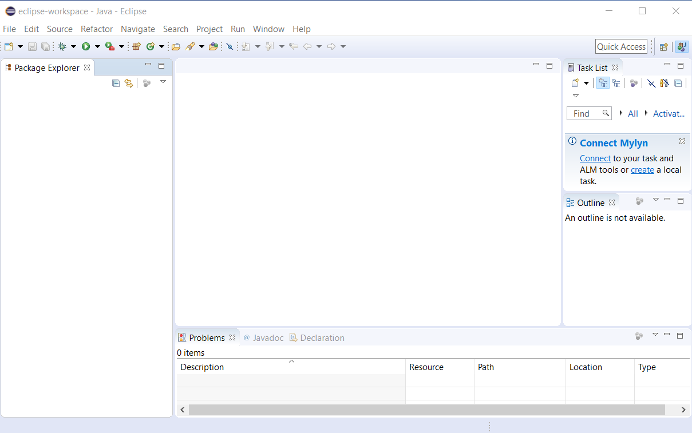
</p>**

**<p style="text-align: center;">
Initial Eclipse Workspace (<a href="../images/eclipse-workspace-0.png">see full-size image</a>)
</p>**

Because the Eclipse `.project` files have already been created and are included in the repository,
a general import of existing project can occur and Eclipse will figure out other
information such as whether a Java project.
Use the ***File / Import...*** menu to start an import, as shown in the following figure.
Click on ***General*** to expand the choices and then on ***Existing Projects into Workspace***.


**<p style="text-align: center;">
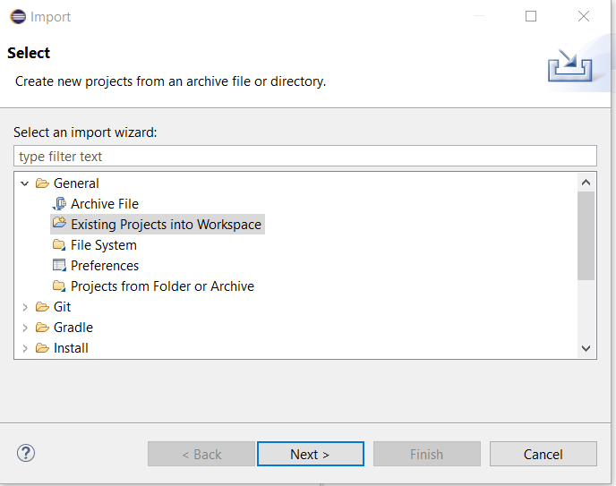
</p>**

**<p style="text-align: center;">
Import Existing Projects (<a href="../images/eclipse-workspace-1.png">see full-size image</a>)
</p>**

Press ***Next >*** in the above dialog to continue to the following step.
Use the ***Browse...*** button to browse to the `git-repos` folder where
repositories where cloned.

**<p style="text-align: center;">
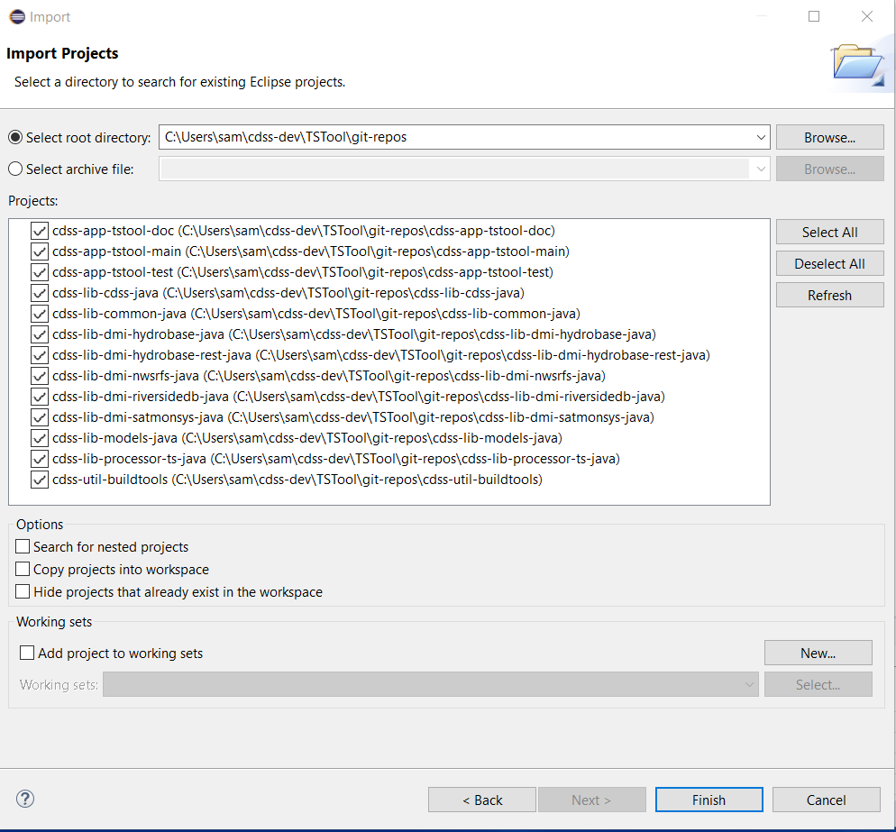
</p>**

**<p style="text-align: center;">
Import Projects - Select Projects (<a href="../images/eclipse-workspace-3.png">see full-size image</a>)
</p>**

All the existing projects can be added at once as shown in the following image.
Note that ***Copy projects into workspace*** is NOT checked and defaults can be used without changing.
This allows the files to exist in the Git repository folders.
Note that some repositories that were cloned, such as newer Markdown/MkDocs documentation,
are not listed because these repositories are typically maintained without using Eclipse.

Press ***Finish*** to start the import.
Eclipse will automatically try to compile TSTool and should properly handle project dependencies because
the `.classpath` file is also saved in each repository/project.
Eclipse may require several minutes to recompile the software.
The default settings may not result in a full build;
however, in the following image there were no fatal errors that prevented a build.
The right arrow (`>`) symbol next to a component indicates that there are changes,
in this case because the files were being modified to create this documentation.

**<p style="text-align: center;">
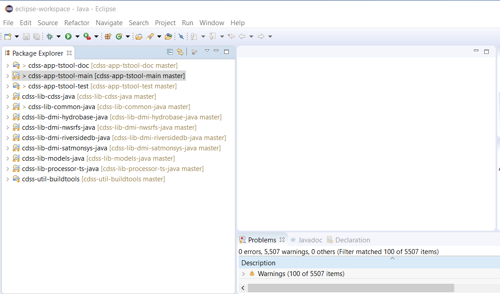
</p>**

**<p style="text-align: center;">
Eclipse Workspace after Importing Projects (<a href="../images/eclipse-workspace-4.png">see full-size image</a>)
</p>**

*Press* ***back*** *in the browser to return to the outline.*

### Additional Eclipse Configuration

It may be necessary to perform additional Eclipse configuration,
in particular to ensure that the proper Java version is used with development.

**The following documentation was created during updates from 32-bit to 64-bit Java 8 and to Eclipse 2019-03.**

The `cdss-app-tstool-main` project in Eclipse has the following JRE configuration.

*   ***Project / Properties / Java Build Path***
*   ***Libraries*** tab
*   ***JRE System Library*** - double click on it
*   Select ***Workspace default JRE*** radio button
*   Select ***Installed JREs...*** button

It may appear as follows since was previously configured to use the 32-bit JRE.
If no installed Java is listed, add as shown in the next step.

**<p style="text-align: center;">
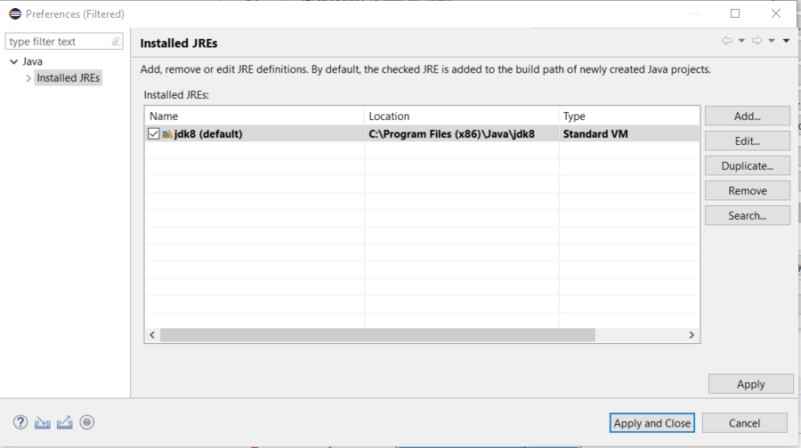
</p>**

**<p style="text-align: center;">
Installed Java Runtime Environments (<a href="../images/installed-jre-0.png">see full-size image</a>)
</p>**

Use the ***Remove*** button to remove the JRE since the 64-bit version will have the same name (but different path).
A warning will be shown as follows.

**<p style="text-align: center;">
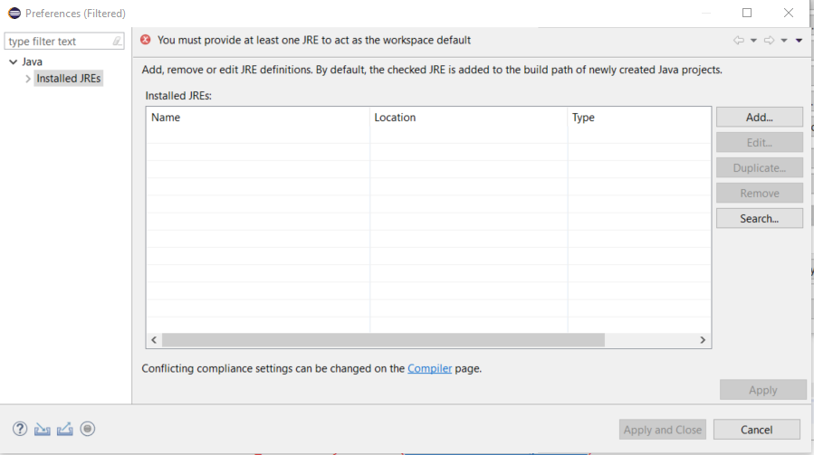
</p>**

**<p style="text-align: center;">
JRE Remove Warning (<a href="../images/installed-jre-1.png">see full-size image</a>)
</p>**

Use the ***Add...*** button.

**<p style="text-align: center;">
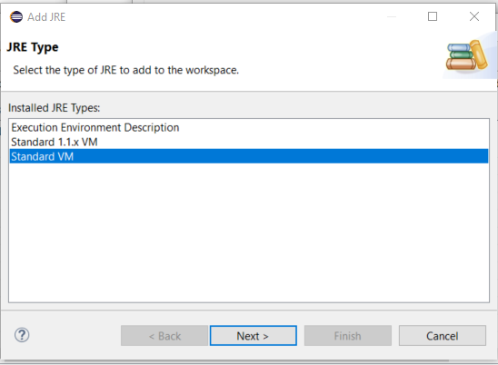
</p>**

**<p style="text-align: center;">
Add JRE (<a href="../images/installed-jre-2.png">see full-size image</a>)
</p>**

Browse to the `C:\Program Files\Java\jdk8` folder that was configured as a symbolic link when Java was installed.
The dialog automatically follows the link and uses the more specific folder.

**<p style="text-align: center;">

</p>**

**<p style="text-align: center;">
JRE Definition (<a href="../images/installed-jre-3.png">see full-size image</a>)
</p>**

Press ***Finish***.

**<p style="text-align: center;">
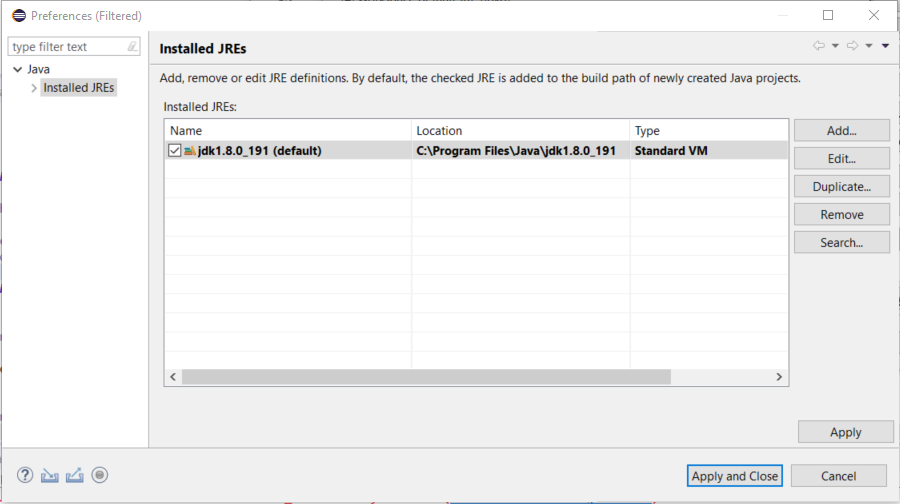
</p>**

**<p style="text-align: center;">
Installed JREs After Adding (<a href="../images/installed-jre-4.png">see full-size image</a>)
</p>**

Accept with ***Finish*** and then ***Apply and Close***.
Then the following is shown.

**<p style="text-align: center;">
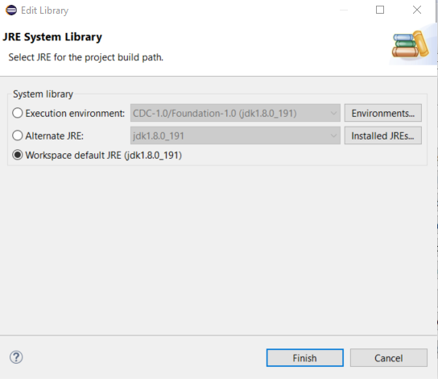
</p>**

**<p style="text-align: center;">
JRE System Library (<a href="../images/installed-jre-5.png">see full-size image</a>)
</p>**

Press ***Finish***.

**<p style="text-align: center;">
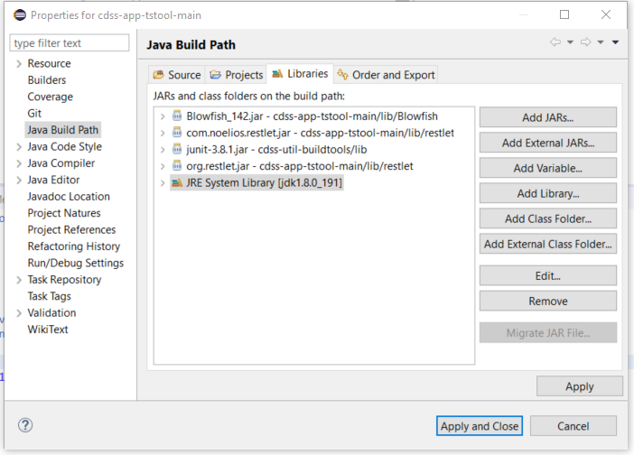
</p>**

**<p style="text-align: center;">
Java Build Path (<a href="../images/installed-jre-6.png">see full-size image</a>)
</p>**

Press ***Apply and Close***.

Do a clean build with ***Projects / Clean...***.

Run TSTool from Eclipse and use ***Help / About*** and then ***Show Software/System Details***.
The `Java Virtual Machine Properties` shows `os.arch = "amd64"`, which indicates 64-bit.

## Next Steps - Development Tasks ##

At this point it should be possible to [compile](../dev-tasks/overview.md#compiling) and
[run](../dev-tasks/overview#running) TSTool within the Eclipse interface].  See also:

*   [Deployed Environment / Overview](../deployed-env/overview.md) - for an overview of the deployed software
*   [Software Design / Overview](../software-design/overview.md) - to understand software structure and logic
*   [Development Tasks / Overview](../dev-tasks/overview.md) - common development tasks
