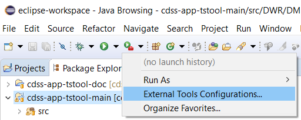
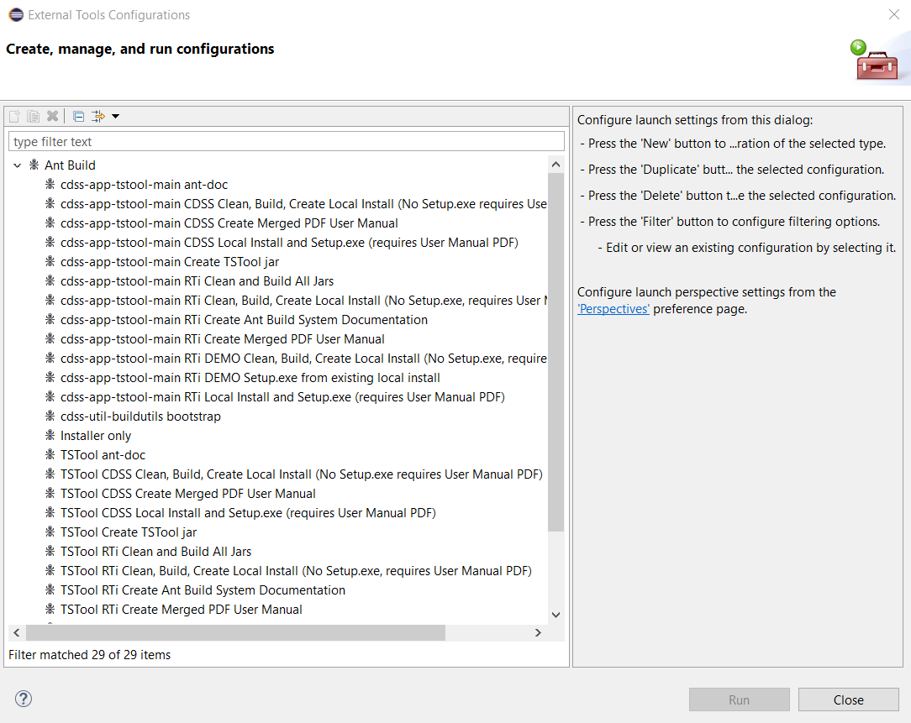
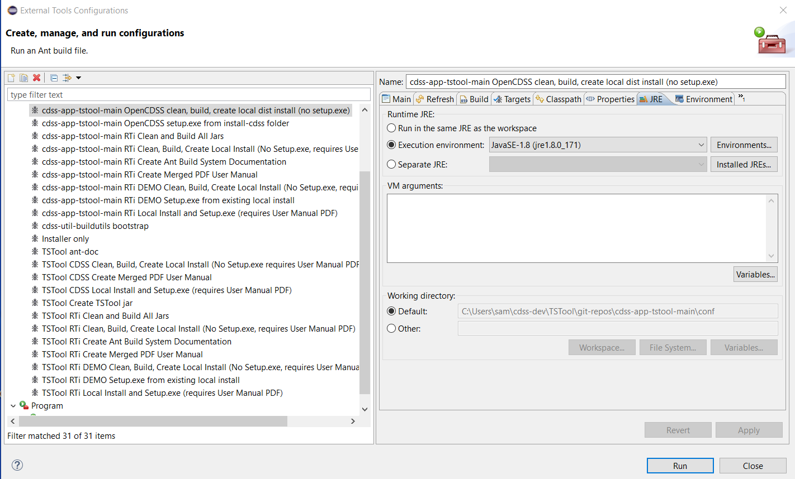
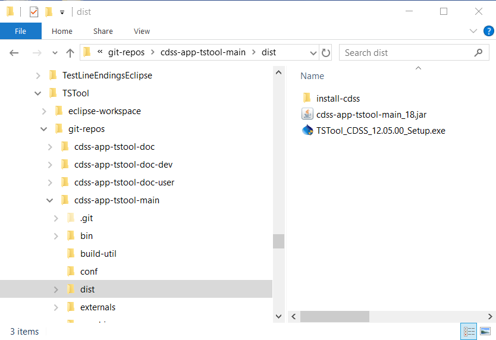
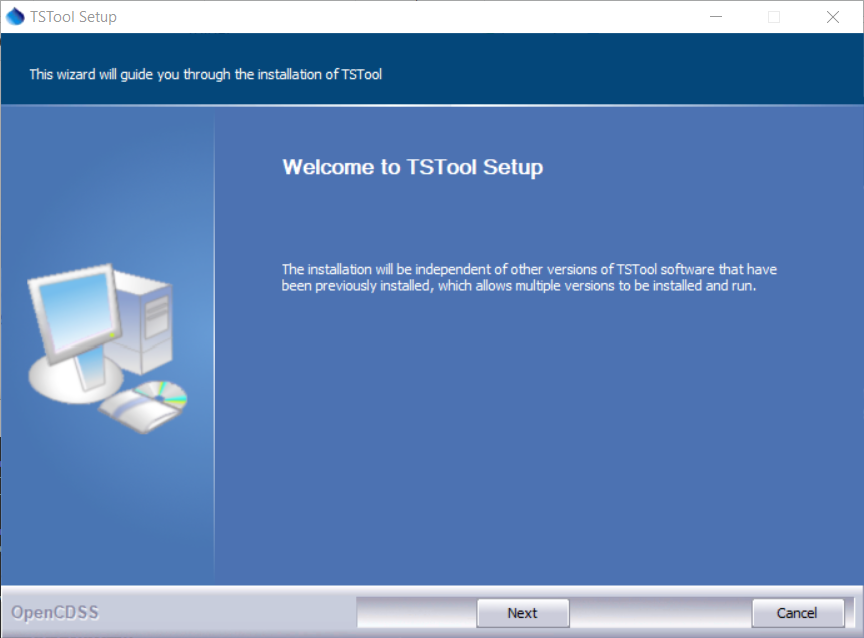

# TSTool / Development Tasks / Building Installer #

This documentation describes how to create and package the TSTool software installer.

*   [Overview](#overview)
*   [Build Tools](#build-tools) - tools used to build the installer
    +   [cdss-util-buildtools](#cdss-util-buildtools)
    +   [Eclipse IDE External Tools](#eclipse-ide-external-tools)
    +   [NSIS](#nsis)
    +   [Java Runtime Environment](#java-runtime-environment)
    +   [launch4j](#launch4j)
*   [Creating a Windows Installer](#creating-a-windows-installer) - the sequence of steps to build the installer
    +   [1. Coordination](#1-coordination)
    +   [2. Release Setup](#2-release-setup)
    +   [3. Clean Build](#3-clean-build)
    +   [4. Update Documentation](#4-update-documentation)
    +   [5. Create Local Distribution](#5-create-local-distribution)
    +   [6. Create Installer](#6-create-installer)
    +   [7. Run the Installer and Test Software](#7-run-the-installer-and-test-software)
    +   [8. Publish the Installer](#8-publish-the-installer)
    +   [9. Repository Maintenance](#9-repository-maintenance)
*   [Creating a Linux Installer](#creating-a-linux-installer)

----------------

## Overview ##

The TSTool installer depends on the target operating system:

*    Windows - self-extracting installer (e.g., `TSTool_CDSS_14.0.0_Setup.exe`).
*    Linux - "run" file installer (e.g., `TSTool-linux-14.0.0.run`).

The Windows installer uses the technologies described below to create the installer.
The Linux installer is created by packaging Windows files on a Linux machine, for example using a shared folder.
Eclipse Ant is used to automate workflows, although Maven might be implemented in the future.
TSTool is complex and sufficient resources need to be available to
evaluate Maven implementation and impacts that it has on the existing build processes.
The following are software tools used to create the installer

*   Eclipse IDE is used to run build processes using ***External Tools Configurations*** - see [instructions for installing Eclipse](../../dev-env/eclipse/eclipse.md).
*   Eclipse Ant is used to automate tasks (comes packaged with Eclipse).
*   Java Runtime Environment (JRE) compatible with TSTool version is packaged with the installer - see [instructions for installing Java](../../dev-env/java/java.md).
*   The NSIS software is used to create self-extracting installer for Windows - see [instructions for installing NSIS](../../dev-env/nsis.md).
*   The launch4j software is used to create a launcher for TSTool, so that it behaves similar to other executable programs - see
    [instructions for installing launch4j](../../dev-env/launch4j.md).

This build process is parallel to the normal Eclipse compile process, but they are separate in some ways.
For example, Eclipse compiles source Java files located in `src` folders into class files located in the parallel `bin` folder.
Eclipse hides the `bin` folder in the IDE in some perspectives because developers don't normally need to see those files.
During interactive development, saving a Java file in the `src` folder will result in a corresponding `bin` file being
updated (assuming there are no errors).

The Ant process used to create the installer uses the same `bin` folder and as part of the build process essentially does a "clean build".
Experimentation in implementing the build processes found that trying to use a separate folder for compiled files
resulted in issues, and sharing the `bin` folder has no issues as long as the same version of Java is used for compiling
and the IDE is not used to edit and compile files while the build processes are running.

The following sections of this documentation describes steps in the build process.
Some historical information is retained in case old versions of the TSTool code need to be re-released.

## Build Tools ##

The build tools for creating TSTool installations have been internalized into the repositories as much
as possible in order to minimize issues.

### cdss-util-buildtools ###

The [cdss-util-buildtools repository](https://github.com/OpenCDSS/cdss-util-buildtools)
contains tools used to build TSTool and other CDSS installers.
At one point it was thought that these tools would follow a hierarchy with general tools in this
repository and specific scripts in each repository.
However, the migration from Subversion (which offered "externals for sub-repositories) to Git 
had issues and it was easier to include application installer scripts in the `cdss-util-buildtools` repository
and supplement as needed with specific files in the main repository for each application
(e.g., see the `installer/` folder in the `cdss-app-tstool-main` repository).
This is OK because there are only a few CDSS Java applications (TSTool, StateDMI, StateView, StateMod GUI)
that rely on the `cdss-util-buildtools` repository.  If there are outstanding issues for any of these products,
they can be resolved through normal issues tracking.
The tools in this repository have primarily been exercised most frequently for TSTool releases.

The `cdss-util-buildtools` repository contains Ant xml "scripts" and configuration for build tools listed below.
Quite often, when troubleshooting or enhancing the process, it is sufficient to search for a string of interest, such as related to a java version or
installation folder, to determine what needs to be changed.

### Eclipse IDE External Tools ###

The Eclipse IDE provides a way to run external tools such as command line software:

**

**

**

Eclipse External Tools Configurations Menu (<a href="../images/eclipse-external-tools1.png">see full-size image</a>)

**

Available run configurations are saved in the repository in `scripts` folder.
The following shows the list of external tool configurations that have been defined for TSTool.
Many of these can be phased out as software development focuses on the OpenCDSS configuration of TSTool.
The specific run configurations of interest are described in the [Creating a Windows Installer](#creating-a-windows-installer) sections.

**

**

**

Eclipse External Tools Configurations (<a href="../images/eclipse-external-tools2.png">see full-size image</a>)

**

### Java Runtime Environment ###

The Java Runtime Environment (JRE) is used to run Java software.
TSTool and other CDSS software distribute a JRE with the software to ensure that the JRE is compatible
with the software.  This takes up more disk space but controls the environment and helps ensure
that even old versions of TSTool will continue run properly.
Packaging the installer requires configuring the location of a JRE for the installer.

### NSIS ###

[Nullsoft Scriptable Install System (NSIS)](../../dev-env/nsis.md)
is open source software that creates the self-extracting executable program to install TSTool.
The installer provides a sequence of dialogs to control the installation.
NSIS was adopted to create TSTool installations because commercial options limited use for developers and
limited the ability to automate creating the installer.
NSIS has proven to be a reasonable tool and changes to the configuration should be minimized if possible.
It is important to update NSIS periodically in order to ensure that the software works on newer
operating system versions.

### launch4j ###

[launch4j](../../dev-env/launch4j.md) is open source software that wraps Java Runtime Environment (JRE) startup for
a Java program so that startup is more streamlined, similar to running any executable program.
There are multiple benefits including being able to configure the title that is shown when a program is minimized
in the task bar, allowing configuration by a text file, etc.

The NSIS software includes a launch4j executable wrapper and configuration file in the final installer program.

## Creating a Windows Installer ##

The following are the major steps needed to create an installer.
The build process occurs in the working files of the `cdss-app-tstool-main` repository,
unless otherwise noted.

### 1. Coordination ###

It is expected that public-facing TSTool releases will not be made after minor updates
unless TSTool users are waiting on new features.
For example, minor releases may occur via the GitHub Releases feature or other methods but may not
be published for State of Colorado projects.
Instead, it is expected that a group of features will be implemented together and will
be packed in an installer.
Consequently, software developers will have access to any changes that are committed
to the repositories that comprise TSTool, but the public will see new versions less frequently.

The TSTool design is intended to promote backward-compatibility while also allowing new features
to be added.  As long as developers are careful to use deprecation, method overloading, etc.,
there generally is not a lot of disruption caused by changes in component libraries or main program.
Normal coordination between developers should occur to discuss when and now updates will be incorporated.

### 2. Release Setup ###

There are two main places that version information needs to be specified.
These should be changed as soon after making a release as possible (and planning for the next release)
to minimize confusion and overwriting the previous release installer in the development environment.

1.  **TSTool Main Program Code** - The [TSToolMain.java](https://github.com/OpenCDSS/cdss-app-tstool-main/blob/master/src/DWR/DMI/tstool/TSToolMain.java) file 
    sets the `PROGRAM_VERSION` with format similar to `14.0.0 (2021-09-14)`.
    As of version 14.x, the parts are **not** padded with zeros.
    However; older versions padded the version parts with zeros).
    If necessary, `.beta`, `.dev1`, etc. can be added
    to the version, such as `14.0.0.dev1 (2021-09-01)`.
    This information is shown in the TSTool ***Help / About*** dialog,
    is used in installer names, is used in versioned documentation, and is shown on the download page.
2.  **Build Process Configuration File** - The
    [cdss-app-tstool-main repository product properties file](https://github.com/OpenCDSS/cdss-app-tstool-main/blob/master/conf/product.properties)
    contains important properties used by the build system to create the installer.
    The `nsis.version` and `exe.version` properties are used by NSIS to create the installer.

### 3. Clean Build ###

It is helpful to do a clean build in Eclipse using ***Project / Clean...*** to confirm that all code and dependency issues are resolved.

### 4. Update Documentation ###

Documentation should be updated to reflect current software features that have changed since the last release,
including adding items to release notes for each issue.
Previous versions of TSTool packaged PDF documentation in the installer but as of TSTool 12.00.05,
PDF documentation is no longer distributed with the software and instead the main ***Help*** menu and
***Help*** menu in each command editor point to online Markdown/MkDocs version of documentation.

Latest ("latest") and versioned copies of documentation are deployed to the cloud.
The latest documentation allows cross-linking documentation using generic URLs.

### 5. Create Local Distribution ###

The software file build process is broken into two main steps.
The first creates a copy of all necessary files in the `dist/install-cdss` folder,
which is ignored in the repository and will be automatically created.
This contents of this folder can then be inspected to make sure files are accurate and in the correct locations.
To run this step, execute the external run configuration as shown in the following figure.

The following image shows the ***External Tools Configurations...*** selection that should be used.

**

**

**

Build Configuration to Create Distribution (<a href="../images/eclipse-external-tools-create-1.png">see full-size image</a>)

**

Note the selection for the JRE that is used, which can be the same as the workspace Java, although any Java 8 should work.

Executing this process causes the Ant build utilities to check the `conf/product-properties` files in each repository
to compile the software.
If any new major components have been added, such as a datastore library, then these files need to be updated,
in particular to indicate dependencies between the components.

The Eclipse ***Console*** window will show the build progress and whether or not the build was successful.
Even if the console output indicates `BUILD SUCCESSFUL`,
it is best to scroll through the messages to see if anything is problematic.

### 6. Create Installer ###

If the previous step was successful, then the ***External Tools Configurations*** target can be run for
`cdss-app-tstool-main OpenCDSS setup.exe from install-cdss folder`.
This step will package the files in the `dist` folder into the installer using NSIS and launch4j software.
The resulting files will be as shown below:

**

**

**

Distribution Files for the Installer (<a href="../images/eclipse-external-tools-create-dist.png">see full-size image</a>)

**

*   `install-cdss` - contains an image of all the files in the distribution before packaging
*   `cdss-app-tstool-main_18.jar` - the Jar file for the main TSTool application corresponding to the repository
*   `TSTool_CDSS_12.05.00_Setup.exe` - setup file that will install TSTool on the Windows computer

The version number for the installer file will match the version in the `product-properties` file.

### 7. Run the Installer and Test Software ###

The setup executable created in the previous step can be run to install the software on the Windows computer,
which will show dialogs similar to the following.

**

**

**

Run TSTool Installer (<a href="../images/installer1.png">see full-size image</a>)

**

All of the defaults should be accepted.

Once installed, the full automated test suite can be run to make sure that tests pass to the same level
as the development environment.

### 8. Publish the Installer ###

The tested installer can be published for others to download and install.
See the [Deploying](../deploying/deploying.md) documentation.

### 9. Repository Maintenance ###

When a release has been made, especially for an important milestone, each repository should be maintained, for example:

1.  Close issues that were resolved.
2.  Make sure that all local changes are committed.
    Run the `build-util/git-check-tstool.sh` script to confirm that there are no loose ends and deal with loose ends.
3.  Run the `build-util/git-tag-all-tstool.sh` script to tag all related repositories for the released TSTool version.

## Creating a Linux Installer ##

A Linux installer can be created by relying on a VirtualBox virtual machine (or similar), as follows:

1.  First install and configure a VirtualBox VM, for example see the
    [Open Water Foundation / Learn VirtualBox](https://learn.openwaterfoundation.org/owf-learn-virtualbox/) documentation.
2.  Configure a VirtualBox shared folder for CDSS files, to allow access to the Windows installed TSTool files.
3.  From a Linux VM terminal window run the `bin/build-linux-distro.bash` script that is distributed with TSTool,
    for the installed version of interest, using the shared folder to access Windows files.
    1.  The source exists in `resources/runtime/bin` folder in the TSTool repository.
    2.  The `makeself` software is used to create the installer (install with `sudo apt-get install makeself` if not already installed).
    3.  The resulting installer can be run on Linux to install TSTool in system or user files.
    4.  The Java version at least that of the compiled TSTool software
        will need to be installed on the VM where TSTool is installed.

Linux versions of TSTool are not currently supported by the State of Colorado.
