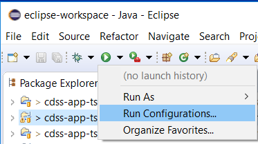
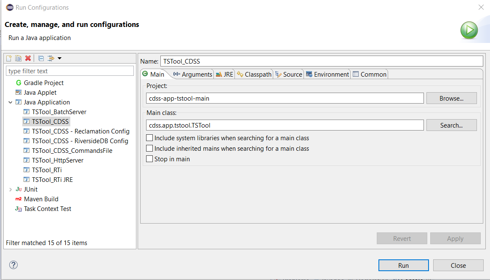

# TSTool / Development Tasks / Running #

*   [Running TSTool from Eclipse](#running-tstool-from-eclipse)
*   [Development Run Environment](#development-run-environment)

----------------

## Running TSTool from Eclipse ##

TSTool can be run within the Eclipse development environment using run configurations.
The following figure shows how to access the configurations.
Old run configurations will likely be removed and new ones added as TSTool continues to evolve.

**

**

**

Running TSTool from Eclipse (<a href="../images/running-configurations-1.png">see full-size image</a>)

**

Run configurations are as follows, and the ***TSTool_CDSS*** run configuration can be used to start an interactive TSTool session:

**

**

**

Running TSTool Eclipse Configurations (<a href="../images/running-configurations-2.png">see full-size image</a>)

**

## Development Run Environment ##

The run environment when working with Eclipse is not the same as the installed software environment.
The following configuration is used to effectively run TSTool during develop and mimic the installed environment:

1.  The `test/operational` folder in the `cdss-app-tstool-main` repository contains files needed to run TSTool as if operational.
    The focus of TSTool has evolved over the years and the CDSS version for Colorado's Decision Support Systems is now the focus.
    All other deployments are legacy implementations and are being phased out.
2.  Command-line parameters are used to tell TSTool where the above test folder is (rather than default installed location).
    For example, see the `TSTool_CDSS` run configuration shown in the previous section.  In particular:
    1.  The run configuration ***Arguments*** settings uses `-home test/operational/CDSS` to tell
        TSTool to use the specified folder for its installation home in the development environment.
        The folder is relative to the Eclipse project location,
        which corresponds to the Git repository working files.
    2.  The ***VM arguments*** are similar to those specified in the Launch4J deployed run-time configuration.
        Additionally, the `-Djava.library.path=$env_var:HECLIB_FOLDER}` setting tells TSTool where to find the HEC-DSS
        native-compiled libraries.
3.  TSTool now uses a `.tstool` folder in the user's files to store user-specific information.
    These files are now also used by developers.
    For example, testing with the State of Colorado's HydroBase database requires using default input type or HydroBase datastore.
    Users can control data access by enabling and disabling datastores as needed.
    Different repositories and documentation provide example datastore configurations that can be used by software developers.
4.  Documentation is now online.
    Therefore, testing any links to documentation will typically point to deployed documentation URLs.
