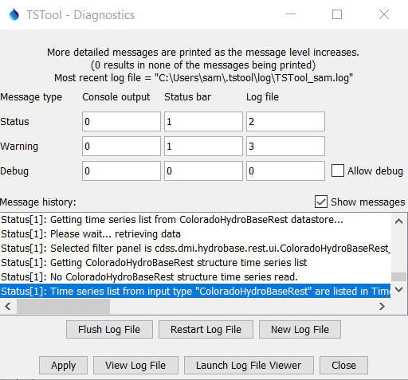

# Logging #

* [Introduction](#introduction)
* [Log Messages](#log-messages)
* [Log Files](#log-files)
* [Setting Logging Levels](#setting-logging-levels)
* [Logging Code Performance](#logging-code-performance)
* [Log File Viewer](#log-file-viewer)
* [Potential Future Changes](#potential-future-changes)

-------------

## Introduction ##

TSTool uses a "home grown" logging approach that was developed early in the TSTool development history
because other options were not available that could meet requirements.
See the [Message package](https://github.com/OpenWaterFoundation/cdss-lib-common-java/blob/master/src/RTi/Util/Message/)
and in particular the
[Message class](https://github.com/OpenWaterFoundation/cdss-lib-common-java/blob/master/src/RTi/Util/Message/Message.java) class.
TSTool provides features to create a log file, view the log file contents interactively,
and control the amount of output to the log file.
Logging at a command level is also integrated via the
[`CommandStatus` class](../CommandStatus/CommandStatus).
A message is often logged using the [Message package](https://github.com/OpenWaterFoundation/cdss-lib-common-java/blob/master/src/RTi/Util/Message/)
to allow review of the session,
and also logged to [`CommandStatus` class](../CommandStatus/CommandStatus) in cases where a message is important enough for user to see in the UI.

## Log Messages ##

Useful information can be logged for debug, status, and warning messages.
Warning level 1 is considered a failure.
Logging messages can further be controlled to output to console (standard output to terminal window),
log file, and user interface (any component that listens to messages).
The general approach is to minimize logging in order to improve performance,
but use logging to provide progress information and inform on issues.

Numeric logging levels can be set for each message type.
Whereas logging frameworks typically set this in a "handler" feature,
the TSTool logging uses configuration data and levels passed in logging methods.

Log levels default in the main TSTool program and can then be set using the ***Tools / Diagnostics...*** menu
(see below for diagnostic settings after TSTool startup)
or the `SetDebugLevel` and `SetWarningLevel` commands.



**<p style="text-align: center;">
Tools / Diagnostics
</p>**

### Warning and Error Message ###

The following is an example of a typical warning message in library code.
Note that the method name (called `routine`) is constructed based on class
information rather than extracting from the call stack, which might be used by a logging framework.

```
String routine = getClass().getName() + ".checkCommandParameters";
message = "Error requesting WorkingDir from processor.";
Message.printWarning(3, routine, message );
```

It is also possible to print the stack trace, as follows:

```
try {
    // Some code
}
catch ( SomeException ) {
    message = "Exception doing something (" + e + ").";
    Message.printWarning(3, routine, message );
    // Do the following if it is helpful to have the exception stack trace at this location
    Message.printWarning(3, routine, e );
}
``` 

The first message includes only the exception main string, not the stack.
The second message prints the stack to the `Message` class internal handlers.
Although it may be a best practice to catch each expected exception and output a suitable message,
it is often typical to catch `Exception` so that nothing falls through.

Within TSTool, the following warning levels are typical:

|**Warning Level**|**Description**|
|--|--|
| `1` | Visible to user in a pop-up dialog (typically only used in main UI because it will block the application).|
| `2` | Use in main application for non-blocking warnings.|
| `3` | Use in command classes when processing data (and log on command).|
| `3+` | Use to indicate less severe warnings (do not log on command).|

It may be appropriate to use the word `Error` in the message, for example:

```
try {
    // Some code
}
catch ( SomeException ) {
    message = "Error doing something (" + e + ").";
    Message.printWarning(3, routine, message );
    // Do the following if it is helpful to have the exception stack trace at this location
    Message.printWarning(3, routine, e );
}
``` 

### Status Message ###

Status messages are equivalent to "info" level in some logging frameworks.
Status messages are useful to understand major "mile markers" in processing,
such as when processing of a TSTool command starts and ends.
The following levels are typically used:

|**Debug Level**|**Description**|
|--|--|
| `1` | Visible to user in a UI, such as the TSTool UI status area.|
| `2` | Important messages, logged to log file.|
| `3+` | Other levels of messages. |

If significant status messages are used, they may need to be converted to debug messages to limit the amount of output in normal situations.

### Debug Message ###

Debug messages are typically wrapped in a check to determine if debug level is active (non-zero).
This improves performance because formatting can be avoid if not in debug mode.

```
resultString = IOUtil.readFromURL(urlString.toString() );
if ( Message.isDebugOn ) {
    Message.printDebug(1,routine,"Returned data="+resultString);
}
```
Logging messages in commands are further "decorated" with command number to help the log file viewer
associate log messages with commands.  The `formatMessageTag` method uses the `command_tag`
(generally the command number 1+ in the command file).

```
message = "Error requesting DateTime(DateTime=" + InputStart + ") from processor.";
Message.printWarning(warning_level,
    MessageUtil.formatMessageTag( command_tag, ++warning_count), routine, message );
```

The following table summarizes typical debug levels.

|**Debug Level**|**Description**|
|--|--|
| `1` | For most important debug levels, and often used for temporary messages (equivalent to printing to console).|
| `2` | Not the most important but close, perhaps within a loop.|
| `3-10` | Top tier messages, where level is used to limit output, perhaps nested loops.|
| `100` | Typically used for only the most detailed output.|

## Log Files ##

TSTool opens a default log file at startup.
Whereas older versions opened the log file in the software installation folder,
newer versions use a startup log file in the `.tstool/log/` folder in the users files, whether Windows or Linux.
This ensures that a log file can be written without administrator permissions.

It is generally recommended that workflows use the
[`StartLog`](http://learn.openwaterfoundation.org/cdss-app-tstool-doc-user/command-ref/StartLog/StartLog/)
command to open a log file that has the same name as the command file, appended with `.log`.
The log file specific to the command file can then be used to troubleshoot the command file.
This approach is used with automated testing to ensure that an artifact exists to review the run.
Log files are typically omitted from repositories using the `.gitignore` file.

Opening a log file with the
[`StartLog`](http://learn.openwaterfoundation.org/cdss-app-tstool-doc-user/command-ref/StartLog/StartLog/) command
closes the previous log file and starts the new log file.
Consequently, use the startup log file to troubleshoot startup issues.

## Setting Logging Levels ##

Logging levels are set in a number of ways:

1. Logging levels are set in the
[Message class](https://github.com/OpenWaterFoundation/cdss-lib-common-java/blob/master/src/RTi/Util/Message/Message.java) class.
2. The [TSTool_Main](https://github.com/OpenWaterFoundation/cdss-app-tstool-main/blob/master/src/DWR/DMI/tstool/TSToolMain.java)
class adjusts based on TSTool defaults and optionally command line parameters.
3. User can interactively change levels via the ***Tools / Diagnostics...*** menu.
4. The [`SetDebugLevel`](http://learn.openwaterfoundation.org/cdss-app-tstool-doc-user/command-ref/SetDebugLevel/SetDebugLevel/) and
[`SetWarningLevel`](http://learn.openwaterfoundation.org/cdss-app-tstool-doc-user/command-ref/SetWarningLevel/SetWarningLevel/) commands can change logging levels,
and are typically used with [`StartLog`](http://learn.openwaterfoundation.org/cdss-app-tstool-doc-user/command-ref/StartLog/StartLog/) command.

Log levels are typically left at the default unless troubleshooting the application.
In this case, 

## Logging Code Performance ##

Logging can be used to evaluate code performance (if other tools are not used).
A simple way is to use the
[`StopWatch`](https://github.com/OpenWaterFoundation/cdss-lib-common-java/blob/master/src/RTi/Util/Time/StopWatch.java)
class to track time and then output using logging messages.
For example, output status message that indicate how many milliseconds were required to complete a task.

## Log File Viewer ##

TSTool's ***Tools / View Log File*** menu displays an interactive log file viewer.
This tool uses custom logging features, such as using the command line number in a command file to
cross-reference log messages.

## Potential Future Changes ##

The current logging approach may be replaced with a standard logging library such as [SLF4J](../resources#slf4j)
if resources allow.
Significant redesign may be necessary in order to continue providing features consistent with the existing software,
such as the log file viewer.
On the other hand, redesigning the logging system will likely provide better integration with component libraries
that use a standard framework.

One issue that needs to be addressed is that the
[Message class](https://github.com/OpenWaterFoundation/cdss-lib-common-java/blob/master/src/RTi/Util/Message/Message.java) class
is an singleton that is shared across an application.
This limits the ability to create "pooled" applications or split logging.
This has not been an issue yet.
