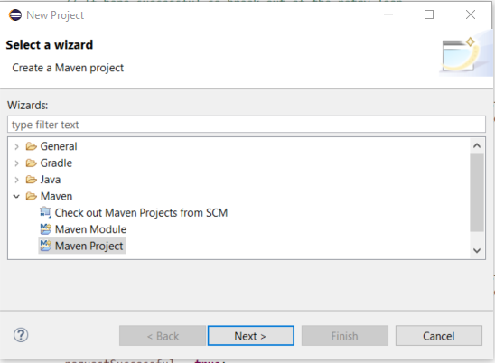
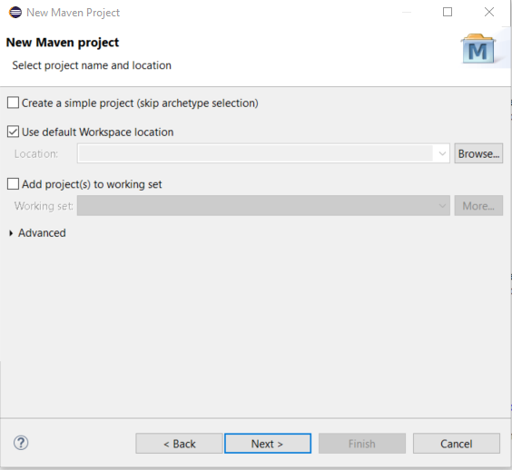
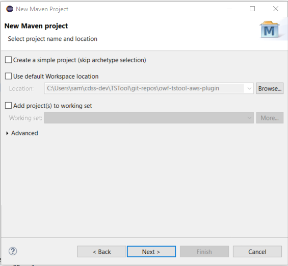
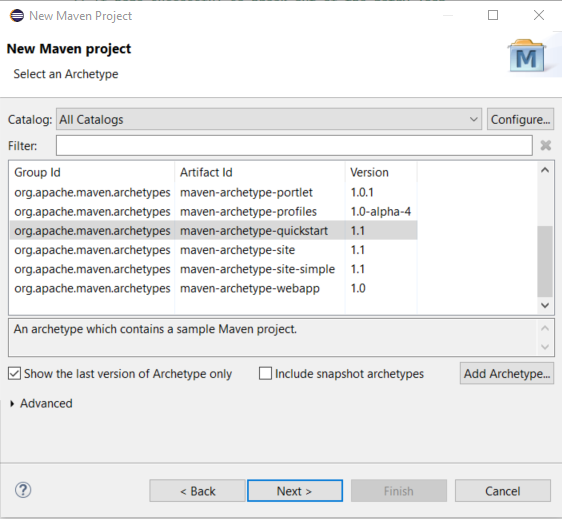
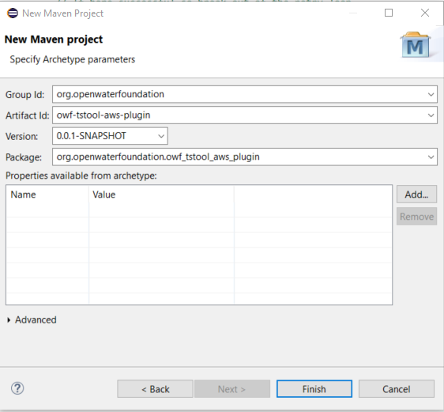
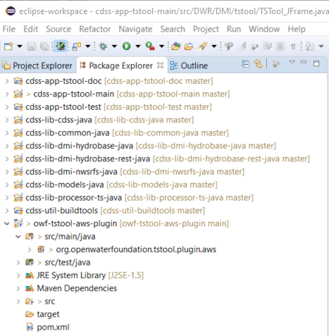
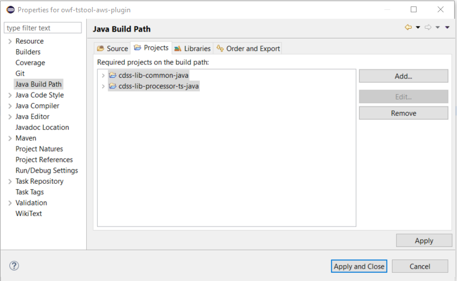
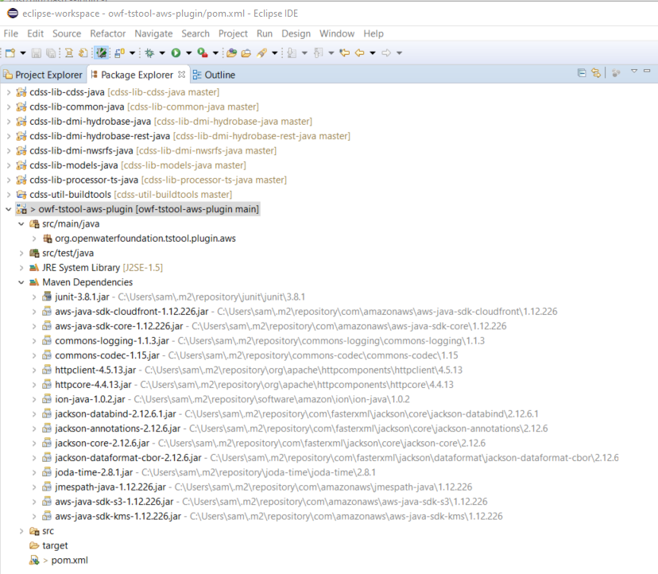

# Plugin Project #

*   [Introduction](#introduction)
*   [Add a New Plugin Project to Eclipse](#add-a-new-plugin-project-to-eclipse)
    +   [Create GitHub Repository](#create-github-repository)
    +   [Add a New Maven Project](#add-a-new-maven-project)
    +   [Configure the Eclipse Project](#configure-the-eclipse-project)
    +   [Configure the POM](#configure-the-POM)

----------------------

## Introduction ##

This documentation explains how to initialize a new Eclipse project for a TSTool plugin.
The examples shown use Java 8, Eclipse 2019-03, and TSTool 14.x.
Different software versions should have similar configuration steps but will vary.

TSTool plugins provide add-on features that are not provided by built-in features.
Plugins are typically implemented for the following:

1.   Datastore, for example to integrate TSTool with a web service or database.
2.   Commands:
    1.   Provide read and/or write commands for a plugin datastore.
    2.   Provide commands that provide some other functionality specific to a technology
         or set of third-part tools.

A plugin in the deployed environment is packaged as a Java `jar` file that is
installed in the software installation `plugins` folder
or a user's `.tstool/##/plugins` folder.
TSTool will automatically recognize a properly constructed plugin and will enable additional
datastores and commands.
The jar file's manifest data and plugin interface methods are used to provide information
about the plugin so that TSTool can display datastore and command features in the user interface.

There can be conflicts in a plugin's dependency versions.
This is an area where additional development may need to occur.

Plugins in the development environment are developed by adding a project to the main TSTool Eclipse workspace,
but the plugin **is not** added to the built-in TSTool build system.
Instead, a script is used to compile and create the `jar` file in the user's TSTool files.
Then, when TSTool is run from Eclipse, it detects the plugin as if in production.
This approach also forces the developer to test the plugin as if a user during development.

The remainder of this documentation describes how to add a new plugin project to the Eclipse workspace
and deal with various general plugin issues.
Separate documentation is available to provide additional details
once the plugin project is initialized and supports development:

*   [Plugin Datastores](../plugin-datastores/plugin-datastores.md) - more information about adding a plugin for a datastore
*   [Plugin Commands](../plugin-commands/plugin-commands.md) - more information about adding a plugin for a command

## Add a New Plugin Project to Eclipse ##

The following example illustrates how to add a new plugin project to Eclipse,
in this case a plugin that integrates with Amazon Web Services.
Java 8 and Maven project is used.

### Create GitHub Repository ###

It is recommended to create an empty plugin repository in GitHub first and then add files in Eclipse,
committing as usual to save incremental work.

Create a GitHub repository that will be used for the plugin, in this example `owf-tstool-aws-plugin`.
The repository can be empty.
Clone the repository under the `git-repos` folder that is recommended for TSTool development (this should have been set up previously)
and add normal files such as `.gitignre`, `.gitattributes`, and `README.md`.

### Add a New Maven Project ###

Maven should be used for newer projects because it manages software dependencies.
A Maven Project Object Model (POM file) `*.pom` is used to list software dependencies and other configuration information.
Required `jar` files are automatically downloaded and are maintained in a local file repository for the user.
In this approach, the Git repository does not contain copies of jar files needed for the project.
However, the plugin that is deployed for the production system contains all necessary `jar` files.
Consequently, if the public Maven repository containing an old dependency `jar` file
is removed in the future, the file can be retrieved from the plugin installation file.
However, it is likely that older software will not need to be installed and recent Maven files should be sufficient.

Add a new project using ***File / New / (Other, if necessary) / Maven / Maven Project***, which shows the following:

**

**

**

Add a New Maven Project - Select Maven Project (<a href="../images/new-project-1.png">see full-size image</a>)

**

Press ***Next >*** to continue.  The following will be shown.

**

**

**

Add a New Maven Project - New Maven Project (<a href="../images/new-project-2a.png">see full-size image</a>)

**

Unselect the ***Use default Workspace location*** choice
because the project files will exist in the Git repository working files.
Use the ***Browse...*** button to select the Git repository folder, which will result in settings similar to the following.

**

**

**

Add a New Maven Project - New Maven Project (<a href="../images/new-project-2b.png">see full-size image</a>)

**

Press ***Next >*** to continue.

Select the Maven project archetype as shown in the following dialog.
The wizard will create the folders used in the project, which follow Maven "archetype" conventions.
See the [Maven Archetypes](https://maven.apache.org/archetypes/) documentation.
The archetype does not appear to be stored in the Eclipse files after the fact so selecting an archetype is
a process of elimination and comparing with the folder structure of other plugins that have been created.
In this case select the `maven-archtype-quickstart` based on a similar plugin that was created,
which involves simple Java files (not J2EE, etc.).

**

**

**

Add a New Maven Project - Maven Archetype (<a href="../images/new-project-3-archetype.png">see full-size image</a>)

**

Press ***Next >*** to continue.

Specify the Archetype parameters, which will be inserted at the top of the `*.pom` file and are used in the Maven dependency checks:

*   ***Group Id*** - it is typical to use the organization domain in reverse order, or a package hierarchy (folder slashes equivalent to periods)
*   ***Artifact Id*** - use the name of the repository, which should be a distinct name that follows appropriate conventions
*   ***Version*** - default is OK, can be changed over time if the plugin is distributed as a Maven package
*   ***Package*** - the Java package that will be created in the source code (`src`) folder,
    can use reverse domain name conventions or other suitable package name
    (in this example a verbose hierarchical package name is used)

**

**

**

Add a New Maven Project - Maven Archetype Parameters (<a href="../images/new-project-4-archetype-parameters.png">see full-size image</a>)

**

Press ***Finish*** to finish.  The following package folders and resources will be initialized (or similar).

**

**

**

Add a New Maven Project - Initial Eclipse Resources (<a href="../images/new-project-5-eclipse-new.png">see full-size image</a>)

**

The Git working files will contain a folder matching the Maven artifact name,
which in this case will result in the parent Git repository folder and the child Maven folder using the same name
(`owf-tstool-aws-plugin/owf-tstool-aws-plugin`).
The Git repository working files will contain a folder for the package.
However, no files will be present in the `owf-tstool-aws-plugin/src/main/java/org/openwaterfoundation/tstool/plugin/aws` folder (or similar).

The initial files can be saved to Git, although empty folders will not result in a commit.
The hidden file `.project` and hidden folder `.settings` can be committed,
although it may be necessary to gitignore settings files in the future if they conflict between developers.

### Configure the Eclipse Project ###

The initial Eclipse project will not have knowledge about other workspace projects or settings that are needed
for development in the TSTool framework.

Right-click on the project in ***Package Explorer*** view and open ***Properties***.

Change the ***Java Build Path / Projects*** tab settings to add the following projects that are needed for plugin development.

**

**

**

Project Properties - Eclipse Java Build Path (<a href="../images/new-project-6-eclipse-properties.png">see full-size image</a>)

**

Change the ***Java Compiler*** tab settings to use JDK 8 compliance and workspace settings (double click on ***Java Compiler***).
The ***JDK Compliance*** must be configured before un-checking the ***Enable project specific settings***.
This generally simplifies the configuration to use the workspace settings across all projects.

**

**

**

Project Properties - Java Compiler (<a href="../images/new-project-7-eclipse-properties-compiler.png">see full-size image</a>)

**

## Configure the POM ##

The `pom.xml` file for the project must be configured for the plugin.
For simple plugins this typically requires adding to the `<dependencies>` for third-party software packages.
Note that configuration discussed above will allow using other TSTool code without adding to the Maven dependencies.
TSTool projects may explicitly include `jar` files that can be used by the plugin,
rather than adding a potentially conflicting dependency in the `pom.xml` file.

After updating the `pom.xml` file, right-click on the project and use ***Maven / Update Project...***.

Additional documentation needs to be added to explain how to package the dependencies in the plugin,
especially when packages are already used in TSTool.
For example, Maven uses the Jackson and Apache commons logging software, which is also used by TSTool elsewhere.
It is possible to include additional jar files in the deployed `plugins` folder but this needs to be tested.
One option is to ensure that the overlapping plugin dependency versions are the same in TSTool as the plugin
so that the software that is found will work in any case.

**

**

**

Project Properties - Maven Dependencies (<a href="../images/new-project-8-eclipse-maven-dependencies.png">see full-size image</a>)

**
