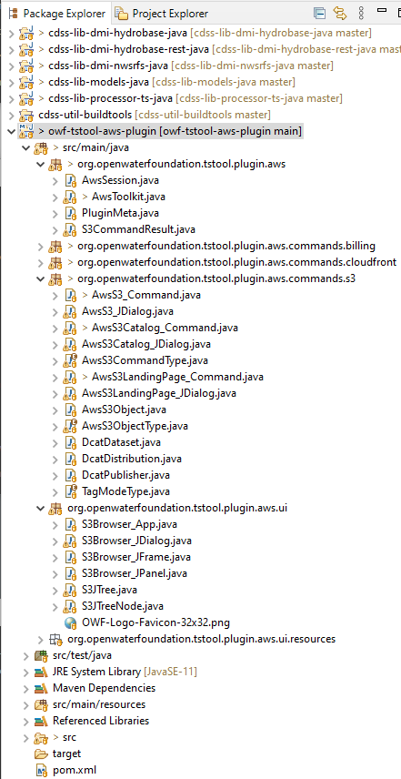

# TSTool / Software Design / Plugins / Plugin Commands #

*   [Introduction](#introduction)
*   [Plugin Metadata](#plugin-metadata)
*   [Command Classes](#command-classes)

----------

## Introduction ##

Code for plugin commands should follow normal TSTool command conventions.
The following indicates typical code organization for commands
(in this case the plugin has multiple commands).

Note that a plugin is not required to provide commands.
However, implementing a plugin datastore (see the [Plugin Commands](../plugin-commands/plugin-commands.md))
without commands to read from the datastore would have little value.
Some plugins implement only commands without datastore integration.

**<p style="text-align: center;">

</p>**

**<p style="text-align: center;">
Eclipse Package Explorer (<a href="../eclipse-package-explorer.png">see full-size image</a>)
</p>**

## Plugin Metadata ##

Plugin metadata are typically stored in a file `PluginMeta.java` in the main source folder, as shown in the following example.
The `VERSION` string is used by the build script.
As of TSTool version 15, the `resources/META-INF/MANIFEST.MF` file in the plugin `jar`
file can also be used to provide plugin metadata because it can be accessed without loading the `jar` file class.

```
// PluginMeta - metadata for the plugin

/* NoticeStart

OWF TSTool AWS Plugin
Copyright (C) 2022-2024 Open Water Foundation

OWF TSTool AWS Plugin is free software:  you can redistribute it and/or modify
    it under the terms of the GNU General Public License as published by
    the Free Software Foundation, either version 3 of the License, or
    (at your option) any later version.

OWF TSTool AWS Plugin is distributed in the hope that it will be useful,
    but WITHOUT ANY WARRANTY; without even the implied warranty of
    MERCHANTABILITY or FITNESS FOR A PARTICULAR PURPOSE.  See the
    GNU General Public License for more details.

You should have received a copy of the GNU General Public License
    along with OWF TSTool AWS Plugin.  If not, see <https://www.gnu.org/licenses/>.

NoticeEnd */

package org.openwaterfoundation.tstool.plugin.aws;

public class PluginMeta {
        /**
         * Plugin version.
         */
        public static final String VERSION = "1.5.7 (2024-12-15)";

        /**
         * Get the documentation root URL, used for command help.
         * This should be the folder in which the index.html file exists, for example:
         *          https://software.openwaterfoundation.org/tstool-aws-plugin/latest/doc-user/
         */
        public static String getDocumentationRootUrl() {
                // Hard code for now until figure out how to configure in the META.
                String url = "https://software.openwaterfoundation.org/tstool-aws-plugin/latest/doc-user/";
                return url;
        }
}
```

## Command Classes ##

Command classes are typically located in a `commands` folder as per the above figure.
There is typically a class to initialize and run the command (e.g., `AwsS3.java`),
and a class to provide the command editor (e.g., `AwsS3_JDialog.java`).
Additional local classes may be uses as needed.

TSTool is made aware of the command classes using the 
`resources/META-INF/MANIFEST.MF` file in the plugin `jar` file.
See the [Plugin Packaging and Installation](../overview.md#plugin-packaging-and-installation)
documentation for information about configuring the command to run in TSTool.

