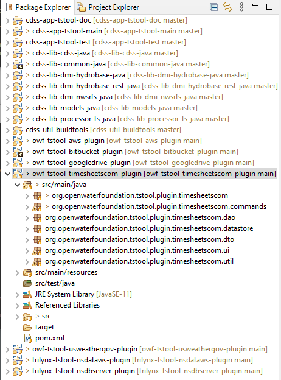

# TSTool / Software Design / Plugins / Plugin Datastores #

*   [Introduction](#introduction)
*   [Datastore Classes](#datastore-classes)
*   [Datastore Configuration Files](#datastore-configuration-files)

----------

## Introduction ##

Code for plugin datastores should follow normal TSTool command conventions.
The following indicates typical code organization for commands
(in this case the plugin has multiple commands).

Note that a plugin is not required to provide datastore integration.
However, a plugin datastore will generally always have one or more commands to read from and/or write to a datastore.
See the [Plugin Commands](../plugin-commands/plugin-commands.md) documentation.

**

**

**

Eclipse Package Explorer (<a href="../eclipse-package-explorer.png">see full-size image</a>)

**

## Datastore Classes ##

Datastore classes are typically located in several folder as per the above figure,
using the following folder conventions.
Refer to existing plugins for examples of Java classes.

**

Typical Datastore Folders

**

| **Folder** | **Contents** |
| -- | -- |
| `datastore` | Datastore and datastore factory classes, |
| `dao` | "Data access object" (DAO) classes, such as classes corresponding to web service API endpoints. |
| `dto` | "Data transfer object" (DTO) classes, such as classes corresponding to database or web service objects. |
| `ui` | User interface classes, such as table models to display objects in TSTool table views. |
| `util` | Utility code that helps isolate the plugin code from TSTool and third-party code dependencies. |

TSTool is made aware of the datastore classes using the 
`resources/META-INF/MANIFEST.MF` file in the plugin `jar` file.
See the [Plugin Packaging and Installation](../overview.md#plugin-packaging-and-installation)
documentation for information about configuring the command to run in TSTool.

## Datastore Configuration Files ##

Datastore configuration files are used to define a datastore connection.
Configuration files are not distributed with the plugin software but must be created in the user's
`.tstool/NN/datastores` folder as per the plugin's documentation.
