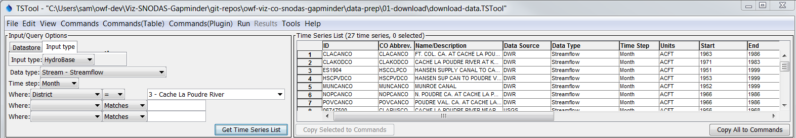
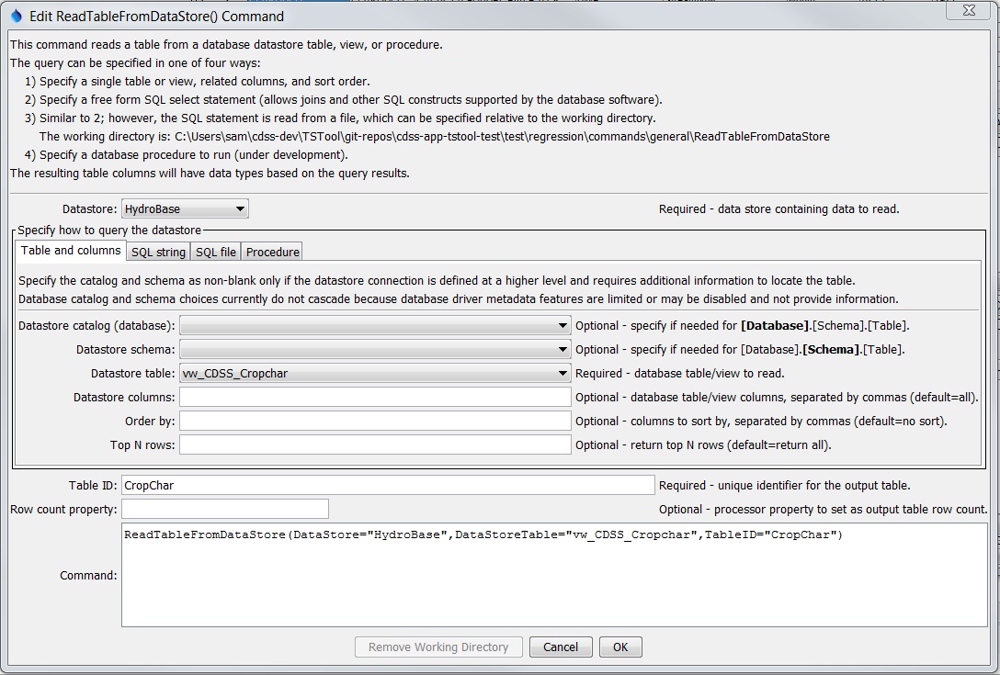

# User Interface (UI) #

The TSTool user interface or UI (also called graphical user interface, or GUI) provides
TSTool software users with an interface to browse data, create workflows of commands,
run the commands, and view results.
The UI is the default run mode when TSTool starts,
unless command-line options such as `-command` are used to indicate batch mode.
The following discussion summarizes the UI design.

* [UI Overview](#ui-overview)
* [UI Startup](#ui-startup)
* [Browsing Data via UI](#browsing-data-via-ui)
* [Command Management in UI](#command-management-in-ui)
* [Adding New Commands via UI](#adding-new-commands-via-ui)
* [Editing Commands via UI](#editing-commands-via-ui)
* [Commands Editor Dialog Design](#command-editor-dialog-design)
* [Running Commands via UI](#running-commands-via-ui)
* [Displaying Results via UI](#displaying-results-via-ui)

------------------

## UI Overview ##

The TSTool user interface design has evolved to its current form based on years of
development, first-hand experience using the software, and responding to user feedback.
The UI currently uses [Java Swing framework](https://en.wikipedia.org/wiki/Swing_(Java)).
The newer [JavaFX framework](https://en.wikipedia.org/wiki/Swing_(Java)) might be used at some point;
however, the amount of code to be updated is large and funding resources are needed to
evaluate and prototype a new UI version to ensure that existing functionality is not negatively impacted.
TSTool is complex software and it is a challenge to keep the interface simple.
Simplicity often means saying no when new features are requested ("can you add a button to...?"),
or finding an elegant way to include complex functionality in a simple design.
A few design guidelines have been followed.

* **Standard UI Menus** - The main components of the interface use standard
terminology and design features seen in common software
because people are familiar with those menus in other software.
This includes ***File***, ***Edit***, ***View***, and ***Help*** main menus.
As much as possible, menu behavior follows common software behavior.

* **Layout of Components Flows** - The TSTool UI features to support user actions
generally flow from left to right and top to bottom.
For example, when processing data, data can be viewed in the top of the main window,
a workflow of commands to automate processing can be created in the middle of the main window,
and results are shown at the bottom of the main window.
Similarly, menus are organized as ***Commands***, ***Run***, and ***Results***.

* **Context-sensitive Features** - It can be difficult to remember how to use software,
in particular when UI components need to be accessed in a disjointed way (click here, click there, etc.).
Context-switching can cause users to think more deeply than they want to for common tasks.
To address these challenges,
many TSTool features can be accessed via simple context-sensitive features such as right-click.
For example, right-clicking on any command shows a pop-up menu of relevant choices, such as ***Edit***.

* **Short-cuts** - Another feature to help users is short-cuts, such as ***Ctrl-key*** or other key combinations
that are equivalent to menus or other actions.
TSTool does not make heavy use of menu shortcuts,
mainly because commands menus have a long list of menu items and it would be difficult to assign menu short-cuts.
Additional use of short-cuts may be implemented in the future,
in particular for common tasks (e.g., ***Ctrl-s*** to save).

* **Feedback** - TSTool can process large amounts of data and it can be difficult to gain a sense of "how much?"
or "how complete?".
Consequently, features are provided to provide feedback:
	+ User interface components that display data typically include a label showing
	how many data items are listed, how many are selected, and other information as appropriate.
	+ The main interface contains progress indicates at the bottom to indicate progress processing
	the commands, and within the current command.
	+ The main window title bar indicates the current command file and status of editing the file in the title
	+ The main interface provides a simple status message at the bottom.
	+ Access to main log file and command-specific logging is provided.
	+ The ***Help / About TSTool*** menu dialog includes a ***Show Software/System Details*** button,
	which provides extensive information about the environment for troubleshooting.

* **Focus on Automation** - a primary goal of UI features is to support automation,
with the assumption that an analysis or visualization task will at some point need to be automated.
Therefore, there is a bias away from interactive-only tools.
Instead, analysis and visualization functionality is often included in a command.
Where appropriate, a ***Tools*** menu or ***right-click*** popup item will be implemented
to access functionality using the same underlying code as used by the command.

* **Provide Command Editor Choices to Minimize User Error** - there is nothing more frustrating to a
software user than not knowing what to enter for data and then being shown cryptic error messages.
Several features are included in TSTool to address this issue.
Most command editor dialogs provide choices such as "combo boxes" that provide
users with valid choices.  This limits user's ability to stray on input and minimizes errors.
The content of such choices is typically determined using one of the following approaches:
	+ Where possible, choices in editors are provided as a list of string values,
	corresponding to "display" data from an enumeration.
	The enumerations can be used in the editors and when processing command parameters into internal values.
	+ TSTool uses a "discovery" mode where some commands are partially run when a command
	file is loaded or new command is added.  The results of the discovery mode are listed in other
	command editors, for example to provide a list of time series and tables that can
	be selected for further processing.
	The discovery mode is indicated by implementing the `CommandDiscoverable` interface on
	a command class, which requires that a `runCommandDiscovery()` function is implemented.
	For example, a command has an `OutputTableID` parameter can provide that table identifier
	in discovery mode so that other commands can list the table ID as a choice.
	This is more difficult to do if processing is dynamic and multiple output is created.
	In this situation, discovery mode may return a string that includes `${Property}` notation,
	which will be OK in later commands because those commands will also product dynamic output.
	Some advanced commands may try to run more deeply in discovery mode to return
	multiple items.

* **Warn up Front if Possible, but Don't Stop Workflow** - TSTool workflows can be complex.
Command files can grow in length as more processing steps are added.
Features such as properties and `For` and `If` commands are provided to implement advanced logic but
can mask logic issues because properties are processed at runtime.
Users can be frustrated when software stops on an error, they fix the problems, and the cycle
is repeated. This can be frustrating because users don't see a full list of problems that
may be related and it takes longer to troubleshoot a workflow.
Experience has shown that providing warnings as soon as possible helps troubleshooting and productivity.
Therefore, the TSTool main interface provides feedback on commands when a command file is first
loaded or created (via discovery run mode described above).
Running commands may clear warnings (because missing data is created dynamically) and 
may generate additional messages.
TSTool attempts to run all commands in a workflow, to provide a full list of warnings and errors.
Users should fix early problems, which often resolves later issues.

* **Access to All Data and Results** - TSTool attempts to provide access to all data and results in
order to promote transparency in understanding workflows and to facilitate troubleshooting.
Where possible, "browse" and right-click features are provided to access data and information.

## UI Startup ##

The TSTool UI is started from the main application class.
The general logic is as follows:

1. The [`DWR.DMI.tstool.TSToolMain`](https://github.com/OpenWaterFoundation/cdss-app-tstool-main/blob/master/src/DWR/DMI/tstool/TSToolMain.java)
class includes a static `main()` method as the entry point into TSTool.
	1. Command line parameters are parsed by the `parseArgs()` method.
	2. After parsing, the UI is started based on command line.
	An instance of `DWR.DMI.tstool.TSTool_JFrame` is created.
	A number of data objects are passed to the method,
	including configuration and other start-up data determined in the main program.
	This approach is taken because such data are also needed when running in batch or other modes.
2. The [`TSTool_JFrame`](https://github.com/OpenWaterFoundation/cdss-app-tstool-main/blob/master/src/DWR/DMI/tstool/TSTool_JFrame.java)
instance serves as the main UI.
3. There is some interaction between the main application, UI,
and [`TSToolSession`](https://github.com/OpenWaterFoundation/cdss-app-tstool-main/blob/master/src/DWR/DMI/tstool/TSToolSession.java)
to manage configuration data.

### Browsing Data via UI ###

The top part of the TSTool UI provides users with a way to browse time series data,
and if desired, create TSID (time series identifier) commands from selected time series.
Primary use cases for using the browse tool are:

1. Browse input data to understand data availability, quality, and data attributes.
2. Command workflow is not working so use the browse feature to troubleshoot input data.

A TSID command is essentially an implicit read command that reads the time series
using default behavior since no command parameters are used.
A user will typically use the browse feature to study time series data availability,
quality, and attributes before trying to use the data in workflow.
The browser is also used to perform ad-hoc data review, for example, select one or more time series to
create TSID commands, run the commands, and view graph products.

At this time, there is no browse feature for other data such as data tables.
To review data tables, use a command to read the table.

The browse area allows selection of a datastore or input type from multiple options,
and the selection becomes active the browse actions.
TSTool tries to remember the previous settings so that switching between choices
displays the previous selections; however, this can be complicated and selections may clear.
Historically, the term "input type" was used to select a file, database, etc.
Recently, the concept of a "datastore" has been used in the design,
which corresponds to configurable connections to data sources,
focusing on databases and web services.
Input types have traditionally been used for file-based input and are useful when
various data files are read,
in contrast to datastores, which tend to use a single configurable data connection.
In the future, input types might be migrated to "file datastore".
The [TSTool datastore appendices](http://learn.openwaterfoundation.org/cdss-app-tstool-doc-user/datastore-ref/overview/)
describe input types and datastores, including configuration.



**<p style="text-align: center;">
TSTool Main Window Browse Area (<a href="../images/ui-main-browse.png">see also the full-size image</a>)
</p>**

TSIDs that are in the command area can be run to retrieve time series.
The command can also be converted to a
[`ReadTimeSeries`](http://learn.openwaterfoundation.org/cdss-app-tstool-doc-user/command-ref/ReadTimeSeries/ReadTimeSeries/)
command by right-clicking on the
command and using the ***Convert TSID command to general ReadTimeSeries() command*** popup menu item.
This action provides a transition from data browsing to command-based automation.
Many datastores have read commands that provide parameters to control reading.

A future enhancement to the browser would be to enable a right-click "Graph - Line" feature,
which would internally create a TSID, retrieve the corresponding time series, and show the graph.

### Command Management in UI ###

Commands can exist in multiple forms, including:

1. Full strings (text) in command files.
2. Full strings in command list UI component (middle of main TSTool window).
3. Parsed strings in command editor dialog.
4. Data in command objects.

A primary goal of TSTool's handling of commands is to be able to represent the commands in simple text form:

```
Command(Parameter1=Value,Parameter2="Value2",...)
```

This ensures that commands are transparent, easily reviewable, and can be manipulated with various tools,
and command files can be version-controlled.
To facilitate manipulation and use of commands in TSTool, each command has two required methods:

* `parseCommand()` - parses a command string into parameter property list (essentially a dictionary of property=value)
* `toString()` - form the complete parameter string

The above methods are used to convert between string and object versions of a command,
as needed in different software components.
The string representation of a command use formatted data to avoid default number representations.
For example, numerical values have a specific number of decimals based on data conventions,
rather than defaulting to Java `toString()`, which may result in too many digits, exponential notation, etc.
This also ensures that text representation of a command does not randomly change as it is
used in different software components.
Both methods are provided in parent
[`AbstractCommand`](https://github.com/OpenWaterFoundation/cdss-lib-common-java/blob/master/src/RTi/Util/IO/AbstractCommand.java)
class but can be defined in each class if needed.
TSTool command syntax have traditionally not required double quotes around parameter values
unless the data type required it.
In the future, quotes may become the default for all parameters to standardize code.
A summary of command management is as follows:

* **Main window command list** - TSTool UI displays the commands in a
[`AnnotatedCommandJList`](https://github.com/OpenWaterFoundation/cdss-lib-common-java/blob/master/src/RTi/Util/IO/AnnotatedCommandJList.java),
which extends [`JList`](https://docs.oracle.com/javase/8/docs/api/javax/swing/JList.html) (`TSTool_JFrame` `__commands_AnnotatedCommandJList`)
using a list of strings as the data model
[`TSCommandProcessorListModel`](https://github.com/OpenWaterFoundation/cdss-lib-processor-ts-java/blob/master/src/rti/tscommandprocessor/core/TSCommandProcessorListModel.java)
(`TSTool_JFrame` `__commands_JListModel`).
The `AnnotatedCommandJList` is the UI component that provides features such as numbering commands and displaying the warning/error indicators.
The [`TSCommandProcessorListModel`](https://github.com/OpenWaterFoundation/cdss-lib-processor-ts-java/blob/master/src/rti/tscommandprocessor/core/TSCommandProcessorListModel.java)
is the data model for the UI list and contains a
[`TSCommandProcessor`](https://github.com/OpenWaterFoundation/cdss-lib-processor-ts-java/blob/master/src/rti/tscommandprocessor/core/TSCommandProcessor.java) instance
(which maintains a list of commands, which include status, etc. shown in the UI).
* **Command File** - command files are simple text files.
The commands that are in the command file exactly match the strings that are displayed in the ***Commands*** workflow
area in the main TSTool window.
When reading a command file with `TSCommanProcessor.readCommandFile()` method,
each line is parsed into a command and is subsequently handled as described in other sections of this documentation.
* **Command Processor** - The TSTool UI keeps an instance of the TSCommandProcessor as (`TSTool_JFrame` `__tsProcessor`).
This instance is used to interact with commands in the processor (via the UI interactions),
run the commands (by calling processor methods),
and retrieve results for viewing (by calling processor methods).
TSTool does run the processor in a thread so that the UI is responsive during running.
This can lead to potential for having multiple processes running,
loading a command file when a previous one is still running, etc.
Consequently, there are some checks done internally to check whether the current
processor is running before starting a new processor task (such as reading a command file).
This seems to be handled reasonably well in existing code,
but is an area of complexity in the code that could benefit from more attention.
* **Command editor dialog** - Command editor dialogs are created as needed to edit commands (see following sections).
Editors are generally "stupid" in that they simply process command parameters as strings.
Where more complex functionality is needed, objects are passed to the command via the dialog constructor.
For example, a list of table identifiers may be passed to the dialog.
Dialogs do also use utility code to request data such as lists of time series.
In the future, greater separation of concerns may occur by passing additional data via the dialog constructor.

### Adding New Commands via UI ###

The TSTool UI is the primary way to add new commands to a workflow, with the following use cases:

1. Add a command to a new or existing workflow.  Repeat to add additional commands.
2. Add a command to see what its syntax is, so that a command file can be
created/edited outside of TSTool with an editor or other tool.

TSTool commands and command files can be easily edited within TSTool or externally because commands are simple text.

The logic to add a new command in a workflow is as follows:

1. When the UI is constructed, [JMenuItem](https://docs.oracle.com/javase/8/docs/api/javax/swing/JMenuItem.html)
objects are created and added to the main menu bar.
[ActionEvents](https://docs.oracle.com/javase/8/docs/api/java/awt/event/ActionEvent.html)
for the menu items are registered on the menus.
A general `actionPerformed(ActionEvent event)` method is implemented to handle the events
as per the required [ActionListener](https://docs.oracle.com/javase/8/docs/api/java/awt/event/ActionListener.html) interface.
2. Using the ***Commands*** menu to select a command to be added generates an `ActionEvent`.
The menu event is processed via the general `actionPerformed()` `ActionListener` method,
which then calls `TSTool_JFrame.uiAction_ActionPerformed01_MainActions()`.
Similar methods are named to match the ***Commands*** menu (such as for commands to filling time series).
Each such method calls the next method in order to process all possible events.
Alternate approaches could be implemented such as registering event handlers for each menu;
however, the implemented approach centralizes menu action processing so it is easy to follow logic and troubleshoot.
Plugin commands are handled differently but are not discussed here.
Multiple such methods exist, and are chained together (one calls the next) until the action event is matched.
The logic within each method is similar to the following:<br>
```
/**
Handle a group of actions for the Commands...Set... menu.
@param event Event to handle.
*/
private void uiAction_ActionPerformed08_CommandsSetMenu (ActionEvent event)
throws Exception
{       String command = event.getActionCommand();

        if (command.equals( __Commands_Set_ReplaceValue_String)){
                commandList_EditCommand ( __Commands_Set_ReplaceValue_String, null, CommandEditType.INSERT );
        }
        else if (command.equals( __Commands_Set_SetConstant_String)){
                commandList_EditCommand ( __Commands_Set_SetConstant_String, null, CommandEditType.INSERT );
        }
        ...
        else {
                // Check the next group of menus...
                uiAction_ActionPerformed09_CommandsManipulateMenu ( event );
        }
```
<br>
3. The `CommandList_EditCommand()` method edits the command.

1. Special handling of comments occurs because multiple comments can be edited at once.
2. Or, if a new command is being edited, a new instance of the command is created
via the [`TSCommandFactory`](https://github.com/OpenWaterFoundation/cdss-lib-processor-ts-java/blob/master/src/rti/tscommandprocessor/core/TSCommandFactory.java) class.
The command class instance `editCommand()` method is called with an instance of the command
to create an editor and modify the parameter list maintained in the command:
	1. The `TSTool_JFrame` instance is passed so that the command editor dialog is positioned above to the main interface
	and command editing is modal (no other UI can be used until the dialog is closed).
	2. If additional data are needed, such as a list of table identifiers available from previous commands,
	that list can be passed to the editor (rather than the command determining that list).
3. If the edit is cancelled in the editor dialog by pressing ***Cancel***, the original command reverts.
4. Or, if the edit is accepted, the new command is inserted in place of the old command.

The command that is being edited is inserted in the command list for visual purposes.
New commands are inserted at the end of the command list, or above the first selected command.
Various UI events occur during and after editing to update the command status in the UI.

### Editing Commands via UI ###

Editing an existing commands via the UI is similar to the process described in the previous section,
with the following logic changes:

* Because the command exists, step 2 creates a copy of the existing command (rather than a new instance).
	+ If the command edits are accepted, the copy is used as the new command instance and
	the original is removed from the command list.

### Command Editor Dialog Design ###

Command editor dialogs have evolved over time but now generally follow a similar design that
extends the [`JDialog`](https://docs.oracle.com/javase/8/docs/api/javax/swing/JDialog.html) class.
It might be possible to implement common behavior in a parent class but this has not been done to date.

#### Editor Layout ####

Editor layout is generally consistent for all commands and uses the
[`GridBagLayout`](https://docs.oracle.com/javase/8/docs/api/java/awt/GridBagLayout.html)
for maximum flexibility.
Consider the example for the
[`NewTimeSeries`](http://learn.openwaterfoundation.org/cdss-app-tstool-doc-user/command-ref/NewTimeSeries/NewTimeSeries/)
command below, which uses a simple layout where parameters are listed vertically
(see the [`NewTimeSeries_Command` command class](https://github.com/OpenWaterFoundation/cdss-lib-processor-ts-java/blob/master/src/rti/tscommandprocessor/commands/ts/NewTimeSeries_Command.java)
and [`NewTimeSeries_JDialog` editor class](https://github.com/OpenWaterFoundation/cdss-lib-processor-ts-java/blob/master/src/rti/tscommandprocessor/commands/ts/NewTimeSeries_JDialog.java)).


**<p style="text-align: center;">
NewTimeSeries Command Editor (<a href="../images/ui-NewTimeSeries-dialog.png">see also the full-size image</a>)
</p>**

The `GridBagLayout` divides a panel into a virtual grid of rows and columns.
The real-estate occupied by rows and columns is flexible and responds to the properties of the UI components
that are located in cells.  If necessary, multiple panels and layouts can be used to achieve the desired overall layout.
The following is a typical configuration for a simple editor:

* The top of each editor displays text to provide an overview of the command functionality.
* A horizontal line separates the narrative from parameter list.
* The number of layout columns is typically the same across all editors, in this example 7.
* The number of layout columns (width) for parameter display is typically:
	+ 1 for parameter label
	+ 2 for parameter value (simple text field or choice), if full width then description is omitted
	+ 1 for parameter description
	+ Use other columns on right side as necessary for more complex input.
* [`Insets`](https://docs.oracle.com/javase/8/docs/api/java/awt/Insets.html)
or other buffering is used around components to improve readability
* Parameter description indicates whether a parameter is optional or required,
and shows default value if not specified.
* Popup tooltips are typically implemented to explain entry field and provides information
beyond the parameter label and description.
* Parameters are typically listed in a logical order such as input, analysis control, output
* The full command text is shown at the bottom, which is useful for development and troubleshooting,
and to provide a convenient way to copy/paste command examples.
* The editor dialog is modal (blocking), meaning that no other user action can be taken
until the editor is closed.
* The editor dialog can typically be non-resizable.
However, if it is resizable, components such as the full command should be configured to change size.
* Choices are coded as static values in the command class or as an enumeration
so that they can be used in the command class and its editor.

More complex command editors are also used as illustrated by the
[`ReadTableFromDataStore`](http://learn.openwaterfoundation.org/cdss-app-tstool-doc-user/command-ref/ReadTableFromDataStore/ReadTableFromDataStore/)
command below, which uses a tabbed panel to organize parameters
(see the [`ReadTableFromDataStore_Command` command class](https://github.com/OpenWaterFoundation/cdss-lib-processor-ts-java/blob/master/src/rti/tscommandprocessor/commands/table/ReadTableFromDataStore_Command.java)
and [`ReadTableFromDataStore_JDialog` editor class](https://github.com/OpenWaterFoundation/cdss-lib-processor-ts-java/blob/master/src/rti/tscommandprocessor/commands/table/ReadTableFromDataStore_JDialog.java)).



**<p style="text-align: center;">
ReadTableFromDataStore Command Editor (<a href="../images/ui-ReadTableFromDataStore-dialog.png">see also the full-size image</a>)
</p>**

Additional design considerations include:

* Parameters can be listed in simple format as shown in previous section and/or
tabbed format can be used.
	+ In this example, the tabs are used because different methods are used to query the database.
	+ Tabs can also be used to for logical grouping of parameters such as ***Input***, ***Analysis***, ***Output***.
	+ Consistent tab names across editors should be used, if possible.
* Each tab should use a layout similar to the simple design, with narrative explanation, parameter label/value/description, etc.
* The `refresh()` method should detect from parameters in an existing command which tab should be selected upon editor creation,
or otherwise select the first tab.
* In this example, the selection of a datastore causes choices in the editor to be updated,
including the tables in the database that can be selected for reading.
Dynamic editor content and cascading choices tend to increase the complexity of editors
but can improve the user experience.
	
#### Editor Event Flow ####

The command editor dialog is created in the `TSTool_JFrame`
class as discussed above in the [Adding New Commands via UI](#adding-new-commands-via-ui) section.
The following methods in the editor handle editing events, using the `NewTimeSeries` command as an example.

* `NewTimeSeries_JDialog` constructor - entry point into the editor
	+ called with chained method call `ok()`, which in the editor returns `true` if ***OK*** is pressed
	in the editor and `false` if ***Cancel*** is pressed
	+ constructor calls `initialize()`
* `initialize()` - creates the editor by instantiating editor dialog components, then calls `refresh()`
* `refresh()` - called by `initialize()` and other methods that handle edit events to make sure command string is current
	+ on first call, populates the editor with defaults and command parameter values from the command
	+ on first call during initialization and subsequent calls in response to events,
	creates the full command string from editor values, using command's `toString(parameters)` method
* If ***OK*** button is pressed, call the `response(true)` method:
	+ Call `checkInput()`, which calls command class `checkCommandParameters()` method to validate input
	+ If checks fail, display a warning about bad parameters and remain in the editor
	+ If checks pass, call `commitEdits()` method, which sets editor parameters into the command parameters,
	and return true via the `ok()` method, meaning successful edit
* If ***Cancel*** button is pressed, call the `response(false)` method:
	+ Exit the editor and return `false` via the `ok()` method, meaning the edit was canceled

### Running Commands via UI ###

The UI runs commands via the ***Run*** menu, or more commonly, via the ***Run Selected Commands*** and
***Run All Commands*** under the command list area.  The logic is as follows:

1. The `TSTool_JFrame.uiAction_RunCommands()` method is called due to the UI event.
2. The list of commands to run is requested from the command list data model,
which recognizes which commands are selected in the UI.
If no commands are selected, all commands are returned.
The list of commands is a list of `Command` objects (not strings).
3. The `TSTool_JFrame.commandProcessor_RunCommandsThreaded()` method is called with
the commands to run.
4. The above method runs in a thread via a
[`TSCommandProcessorThreadRunner`](https://github.com/OpenWaterFoundation/cdss-lib-processor-ts-java/blob/master/src/rti/tscommandprocessor/core/TSCommandProcessorThreadRunner.java) instance.
A `run()` method starts the run as per the [`Runnable`](https://docs.oracle.com/javase/8/docs/api/java/lang/Runnable.html) interface.
5. The command processor `processRequest("RunCommands",...)` request is processed.

Because a thread is used to process commands, the main UI is responsive to other user actions.
This also allows the thread to be killed.
Doing so is not a clean operation within Java so there may be side-effects.
However, it works reasonably well in the current implementation.

### Displaying Results via UI ###

When commands are run as per the previous section, logic control switches back to the main UI
and actions are taken to display the results in the ***Results*** area at the bottom of the main window.
The results are consistent with the state of the processor after processing commands.
If only a subset of commands were processed using ***Run Selected Commands***
or by using [`Exit`](http://learn.openwaterfoundation.org/cdss-app-tstool-doc-user/command-ref/Exit/Exit/) command,
then results may be less than for a full run.

TSTool attempts to provide access to all results from running commands, via UI components in the ***Results*** area.
In some cases the results are in-memory resources such as time series, time series ensembles,
problems generated during the run, processor properties,
tables, and data views, and are displayed using built-in components.
In other cases, the results are external, such as output files, and may be viewed using external programs
such as Excel, a web browser, image viewer, or editor.
