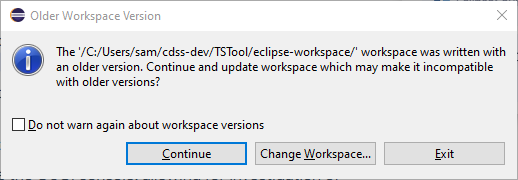
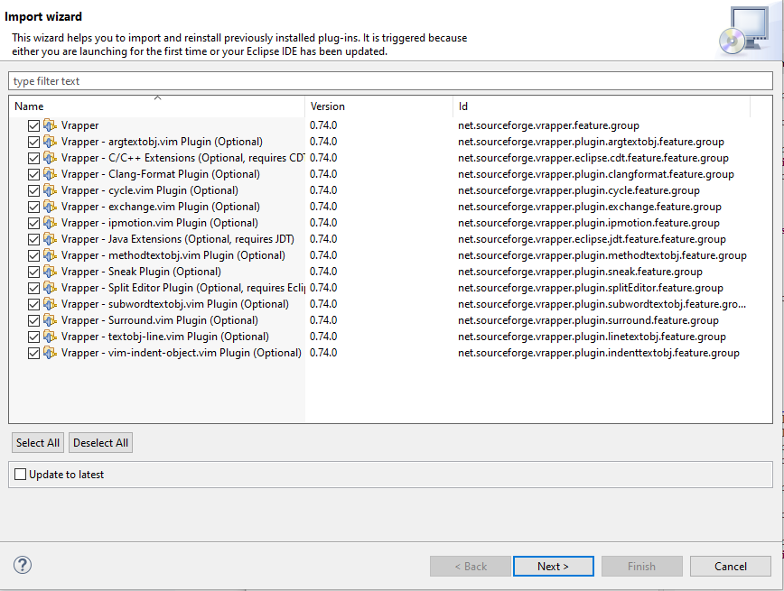

# TSTool / Update Java / Overview ##

This documentation describes the steps needed when updating the Java version.

*   [Introduction](#introduction)
*   [Update Java from Version 8 to 11](#update-java-from-version-8-to-11)

------------------

## Introduction ##

TSTool is written in the Java language and is developed using the Eclipse IDE, which runs Java.
Java is a mature language but continues to be enhanced over time.
The Java development tools must also be updated to be compatible with newer operating systems.
This documentation summarizes steps that were taken to update Java from one version to another.

## Update Java from Version 8 to 11 ##

Java 8 was used for many years due to its stability.
TSTool was updated to use Java 11 in 2025 and the plan is to update TSTool to newer
long-term support (LTS) releases every several years to ensure that TSTool's version of Java is up to date.

Updating the version from 8 to 11 required a number of basic changes,
including handling simple version number like `11` whereas previously `1_8` or `18` was used
due to Java historical version conventions.

The following steps were taken to update an existing development environment from Java 8 to 11.
The developer documentation was updated as software was updated.

1.  Backup files:
    *   Copy the entire `TSTool` development folder with all local repository working files to a backup folder.
        These files will only be used for comparison as necessary and can be removed in the future.
2.  Install Java 11:
    -   OK to leave Java 8 if it exists because it may be used by other software (can remove later).
3.  Install Eclipse 2022-06, which is the last Eclipse version that runs with Java 11:
    *   Make sure that the Eclipse version is compatible with the Java version used with Eclipse.
        Otherwise, an error may result that is difficult to troubleshoot.
    *   OK to leave 2019-03 if it exists because it may be used by other software.
    *   Update the Eclipse run script to use the latest Eclipse and Java:
        +   `build-util/run-eclipse-win64.cmd`
        +   `build-util/run-eclipse.bash`
4.  Update the runtime scripts:
    *   Update the `resources/runtime/bin/tstool` script to run on Linux using Java 11 or later.
5.  Update the Linux distribution build scripts:
    *   Update the `resources/runtime/bin/build-linux-distro.bash` script to use Java 11
6.  Run Eclipse:
    *   Use the `build-util/run-eclipse-win64.cmd` script in a Windows command shell.
        -   It should find the Exclipse 2022-06 version.
        -   If an error dialog is shown, try running the `eclipse.exe` program in the Eclipse installation folder
            (cancel before opening the workspace).
        -   If the above works but still have an error from the run script,
            try editing the run script to add other command line parameters until the problem is identified.
    *   A warning may be shown as follows.  Press ***Continue*** to update the workspace configuration.

        **

        
        
**

        **

        Older Workspace Version Warning (<a href="../1-older-workspace-warning.png">see full-size image</a>)
        
**

    *   A dialog may be shown as follows to update Eclipse plug-ins.
        In this case, the ***Vrapper*** plug-in was previously installed to provide "vim" editor behavior within Eclipse.
        Press ***Next >*** to update the plugins that are listed.
        Additional confirmation steps may occur.

        **

        
        
**

        **

        Plugin Import Wizard (<a href="../2-plugin-import.png">see full-size image</a>)
        
**

    *   Eclipse will rebuild the projects and may prompt to restart to apply the software update.
        Pressing ***Restart Now*** to continue may not properly restart.
        Restart Eclipse using the run script.

7.  Additional Eclipse configuration:
    *   The Java software and Java compatibility version need to be updated to Java 11.
        See the [New Developer Setup / Overview / Additional Eclipse Configuration](../dev-new/overview.md#additional-eclipse-configuration) documentation.

8.  Code changes:
    1.  The following project changes were made:
    
        | **Project**&nbsp;&nbsp;&nbsp;&nbsp;&nbsp;&nbsp;&nbsp;&nbsp;&nbsp;&nbsp;&nbsp;&nbsp;&nbsp;&nbsp;&nbsp;&nbsp;&nbsp;&nbsp;&nbsp;&nbsp;&nbsp;&nbsp;&nbsp;&nbsp;&nbsp;&nbsp;&nbsp;&nbsp;&nbsp;&nbsp;&nbsp;&nbsp;&nbsp;&nbsp;&nbsp;&nbsp;&nbsp;&nbsp;| **Change** |
        | -- | -- |
        | `cdss-lib-satmonsys-java` | Delete from the workspace since it is legacy code and is no longer used. |

    2.  The following specific code changes were made.
        After the changes, approximately 1,170 warnings remain (reduced from over 3,500 after initial updates,
        with most being in UI-related code that requires more paramaterization for data lists.
        The code is OK for now and can be clarified as maintenance is performanced.
        Issues that seem more problematic have been added to repository issues to increase visibility for maintenance.

        | **Package**&nbsp;&nbsp;&nbsp;&nbsp;&nbsp;&nbsp;&nbsp;&nbsp;&nbsp;&nbsp;&nbsp;&nbsp;&nbsp;&nbsp;&nbsp;&nbsp;&nbsp;&nbsp;&nbsp;&nbsp;&nbsp;&nbsp;&nbsp;&nbsp;&nbsp;&nbsp;&nbsp;&nbsp;&nbsp;&nbsp; | **Class**&nbsp;&nbsp;&nbsp;&nbsp;&nbsp;&nbsp;&nbsp;&nbsp;&nbsp;&nbsp;&nbsp;&nbsp;&nbsp;&nbsp;&nbsp;&nbsp;&nbsp;&nbsp;&nbsp;&nbsp;&nbsp;&nbsp;&nbsp;&nbsp; | **Change** |
        | -- | -- | -- |
        | `DWR.StateMod` | `StateMod_NodeNetwork` and `StateMod_Network_JFrame` | Use new XML parsing classes. |
        | `RTi.GR` | `GRCanvasDrawingArea` | Remove import of the `sun.font.FontManagerFactory` class since no longer available and import is not needed. |
        | `RTi.GRTS` | `TSGraphJComponent_SaveAsSVG` | The code has issues with the w3c class conflicts.  Disable Batik since a JFreeChart version that is stand-alone is enabled. |
        | `RTi.Util.IO` | `SecurityCheck` | Remove the `canCheckAWTEventQueue()` and `canUseClipboard()` methods since not used and has unsupported code. |
        | `RTi.Util.IO` | `XmlToolkit` | See the `RccAcisDataStore` issue below.  Fix by using the `xmlbeans-2.3.0-fixed.jar` library dependency.  Also use the `jython-fixed.jar`, with `w3c` classes removed. |
        | `rti.tscommandprocessor` `.commands.email` | `SendEmailMessage` | Classes `javax.activation.DataHandler`, `DataSource`, and `FileDataSource` are no longer available.  Replaced with `jakarta.activation.DataSource`, etc. and add the `lib/jakarta-activation/jakarta-activation-api-2.1.3.jar` library dependency. |
        | `rti.tscommandprocessor` `.commands.rccacis` and others| `RccAcisDataStore` | The code uses `org.w3c.dom` classes to parse XML.  These are built-in classes.  The `xmlbeans-2.3.0.jar` file that is used with the Apache POI library to read and write Excel also incldues `org.w3c.dom`.  See the fix below. |
        | `rti.tscommandprocessor` `.commands.waterml2` | `WaterML2Reader` | The `javax.xml.bind` package is not available in Java 11.  A separate library is available on Maven Central and is installed as `lib/jaxb-api/jaxb-api-2.3.1.jar`.  Glassfish `jaxb-runtime-2.3.2.jar` is also needed to marshal and unmarshall files.  With more work the library can be migrated to Jakarta classes. For now, keep the functionality the same as the Java 8 classes. Changes resulted in duplicate `javax.xml.nmespace` classes.  The POI `stax-api-1.0.1.jar` file seems to be not needed with changes so remove from he dependency list. |
        | `rti.tscommandprocessor` `.commands.waterml2` | `WaterML2Reader` | The `ElementNSImpl` class is not available in Java 11. It was part of the `xercses` DOM parsor.  Use the built-in `Element` class instead. |
        | `gov.usda.nrcs.wcc.ns.` `awdbwebservice` | `AwdbWebService` | `javax.jws` packages not found in Java 11.  The solution is to use `javax.jws-api` Maven package to keep the legacy classes.  Updating to the Jakarta equivalent can occur later. |
        | `gov.usda.nrcs.wcc.ns.` `awdbwebservice` | `AwdbWebService` | `javax.xml.ws` packages not found in Java 11.  The solution is to use `javaws.api` Maven package to keep the legacy classes.  Updating to the Jakarta equivalent can occur later. |
        | `gov.usda.nrcs.wcc.ns.` `awdbwebservice` | `AwdbWebService` | `com.sun.xml.internal.ws.client.BindingProviderProperties` package is not found in Java 11.
        | Runtime error for NRCS AWDB web services. | `AwdbWebService` | `com.sun.istack.` `localization.Localizable` not found.  Need to include the `jaxb-impl` Maven artifact by downloading the jar. |
        | Runtime error for NRCS AWDB web services. | `AwdbWebService` | `com.sun.xml.stream.` `buffer.AbstractCreatorProcessor` not found.  Need to include the `streambuffer` Maven artifact by downloading the jar. |
        | Runtime error for NRCS AWDB web services. | `AwdbWebService` | `com.sun.xml.ws.` `policy.PolicyException` not found.  Need to include the `policy` Maven artifact by downloading the jar. |
        | Runtime error for NRCS AWDB web services. | `AwdbWebService` | `org.jvnet.staxex.` `XMLStreamReaderEx` not found.  Need to include the `state-ex` Maven artifact by downloading the jar. |
        | Runtime error for NRCS AWDB web services. | `AwdbWebService` | `javax.xml.soap.` `SOAPException` not found.  Need to include the `javax.xml.soap-api` Maven artifact by downloading the jar. |
        | Runtime error for NRCS AWDB web services. | `AwdbWebService` | `com.sun.xml.internal.` `messaging.saaj.soap.SAAJMetaFactoryImpl` not found.  Need to include the `saaj-impl` Maven artifact by downloading the jar. |
        | Runtime error for NRCS AWDB web services. | `AwdbWebService` | `javax.activation.` `DataSource` not found.  Need to include the `javax.activation` Maven artifact by downloading the jar. |
        | Runtime error for NRCS AWDB web services. | `AwdbWebService` | `org.glassfish.gmbal.` `ManagedObjectManager` not found.  Need to include the `gmbal-api` Maven artifact by downloading the jar. |
        | `RTi.GIS.GeoView` | `GeoViewLegendJTree` | Fix unallowed type handling of `TreeNode`. |
        | `RTi.GIS.GeoView` | `GeoViewLegendJTree_Node` | Fix unallowed type handling of `TreeNode`. |
        | `RTi.GIS.GUI` | `SimpleJTree_WindowsGUI` | The `com.sun.java.swing.` `plaf.windows.WindowsTreeUI` class is not available.  Switch to `javax.swing.plaf.basic.BasicTreeUI`. |
        | `RTi.GIS.GUI` | `SimpleJTree` | The `com.sun.java.swing.` `plaf.windows.WindowsTreeUI` class is not available.  Switch to `javax.swing.plaf.basic.BasicTreeUI`. |
        | Many. | Many | Constructing primitives with `new` is now depreciated and, for example `Integer.valueOf()` should be used instead. |
        | `RTi.GRTS` | `TSGraphComponent` | `MouseEvent.getModifiers()` is deprecated.  Use `getModifiersEx` and new InputEvent bitmask values instead. |
        | Many | Most classses | The `finalize()` method was deprecated in Java 9.  Remove all the methods. |

        As of Java 9, the class loading changed to use the Java Platform Module System (JPMS), also known as Project Jigsaw.
        One impact is that the same path cannot exist in multiple jar files.
        In the case below, the Apache `xmlbeans-2.3.0.jar` file contains mostly Apache-specific classes,
        but also contains the following:

        `org/w3c/`  
        `org/w3c/dom/`  
        `org/w3c/dom/DOMConfiguration.class`  
        `org/w3c/dom/DOMStringList.class`  
        `org/w3c/dom/TypeInfo.class`  
        `org/w3c/dom/UserDataHandler.class`  

        Because they are duplicates of classes included in Java, the following error is shown:

        **

        
        
**

        Using ***Ctrl-Shift-t*** in Eclipse allows searching for the `org.w3c.dom` package, as shown in the following figure.

        **

        `org.w3c.dom` Conflict Error (<a href="../3a-org-w3c-dom-conflicts.png">see full-size image</a>)
        
**

        **

        
        
**

        **

        Eclipse Ctrl-Shift-t output for `org.w3c.dom` conflicts (<a href="../3b-org-w3c-dom-conflicts.png">see full-size image</a>)
        
**

        To fix, create a script `cdss-lib-processor-ts-java/lib/apache-poi/fix-xmlbeans.bash` that removes the above classes
        and creates a new jar file `xmlbeans-2.3.0-fixed.jar`.  Remove the old file from the libraries dependencies and add the new file.
        This clears up the errors.

        This basic procedure is repeated for all duplicate classes mentioned in the table above.
        In the future, moving to REST web services that use a library such as Jackson to parse the response
        will eliminate the need for SOAP and XML parsing packages, which seem to cause the most issues.
        Dependency management will be an issue as more plugins are added.
        Code for TSTool and plugins may need to be periodically (re)synchronized and in some cases Jar file contents
        may need to be manipulated to remove unnecessary classes.

9.  Build system:
    1.  Update the `conf/product.properties` files to use Java 11 instead of 8.
    2.  Add libraries identified above, which were also added to the build path in Eclipse.
        Also remove and change library names as indicated.
    3.  Update the `cdss-util-buildtools` project for Java 11.
        Add support for simple integer main version like `11` and phase out more complex `1.8` notation.
        *   `common.xml`
        *   `common-installer.xml`
        *   `conf/product.properties` - default properties
   4.  Update the `cdss-app-tstool-main/installer/CDSS/TSTool.nsi` to use lowercase `dist\install-cdss` folder.
   5.  Update the `cdss-app-tstool-main/externals/CDSS/installer/CDSS/cdss.nsh` to use lowercase
       `dist\install-cdss` folder (just a comment).
   6.  Update the `cdss-util-buildutils/externals/NSIS_Common/JRE.nsh`:
       *   As of Java 9, the `rt.jar` file is not used and instead Jigsaw modules are used.
           Disable the old code.
   7.  Update `launch4j`:
       *   Successfully created an NSIS installer with the above changes, but TSTool had an error launching.
       *   Use `launch4j` version 3.50 and save in the `cdss-util-buildtools/lib/launch4j` folder.
       *   Save the old version to the `launch4j-java` folder.
       *   This did not end up being the issue but keep the newer version.
